# 🚀Solution: AWS Scalable & Secure Web Hosting Architecture  

## 🪜 Step-by-Step Implementation

### 1️⃣ Create IAM User & Assign Permissions
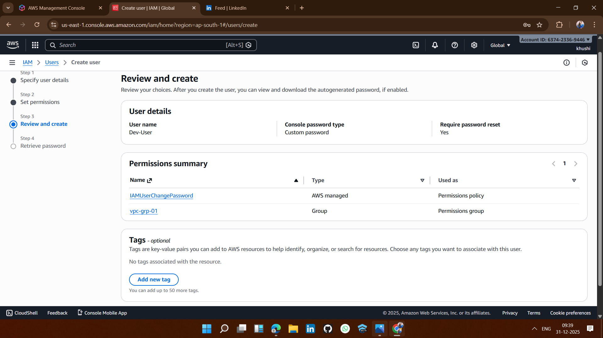

### 2️⃣ VPC & Networking Setup
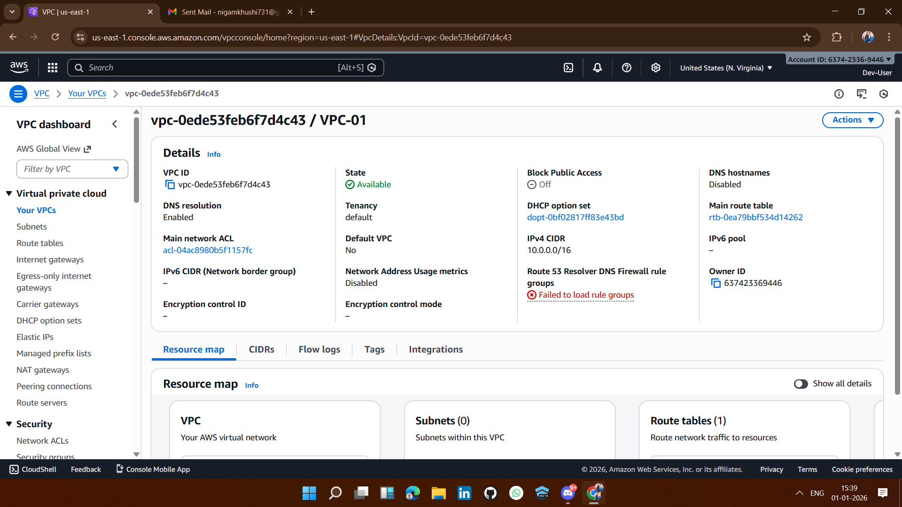

### **STEP : Create VPC**

### **STEP : Create Subnets (2 Public + 2 Private)**
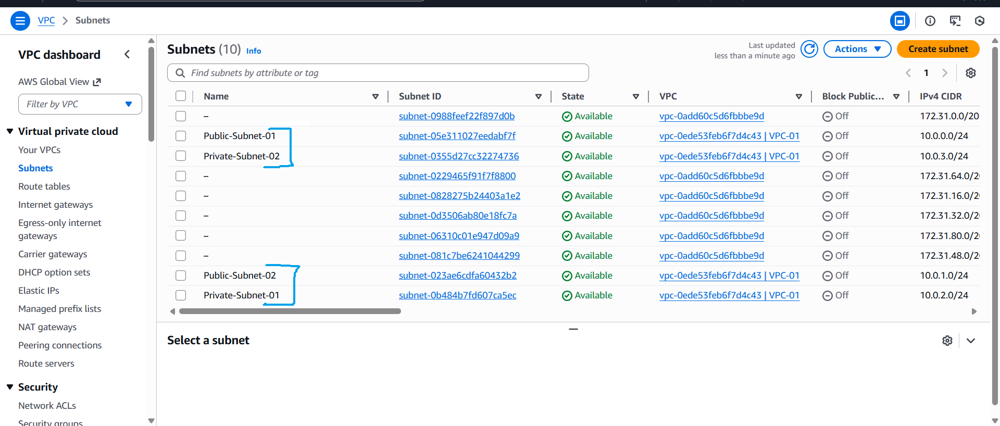

### **STEP : Create Internet Gateway**
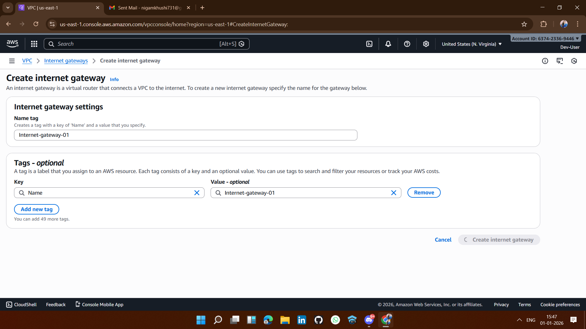

### **STEP : Create Route Table**
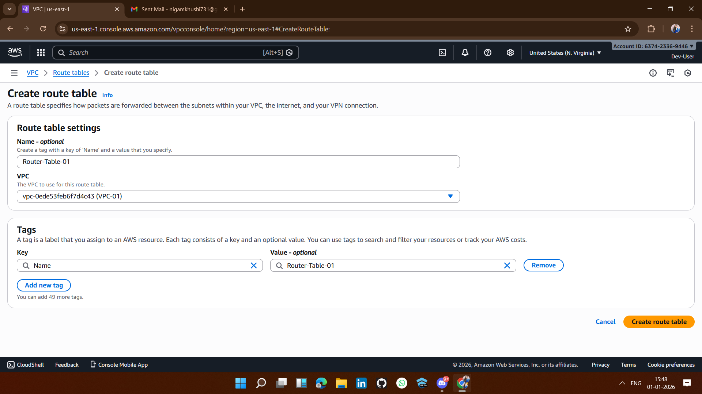

### **STEP : Create NAT Gateway (for outbound access from private subnets) **
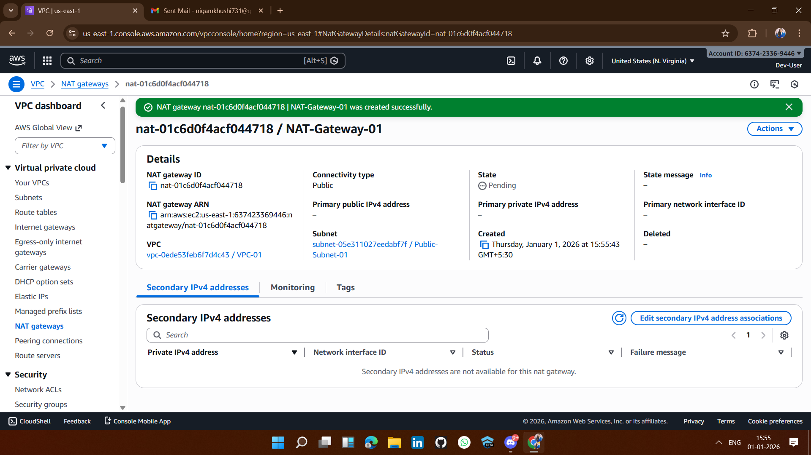

### 3️⃣ Launch EC2 Instances
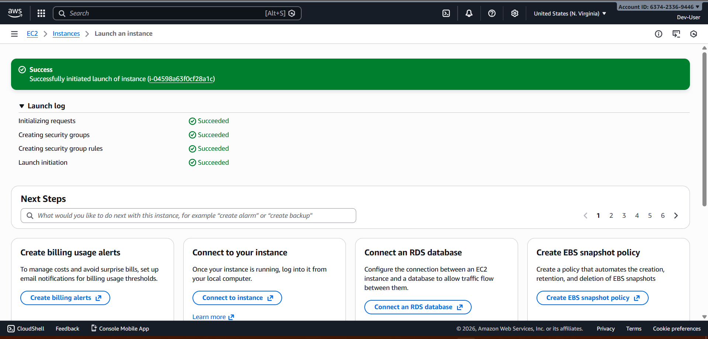

### 4️⃣ Create Target Group
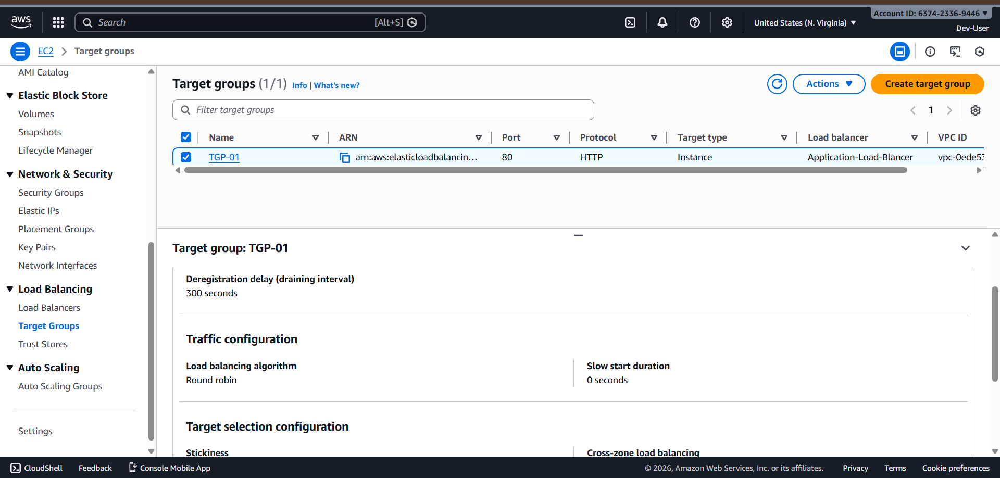

### 5️⃣ Configure Application Load Balancer (ALB)
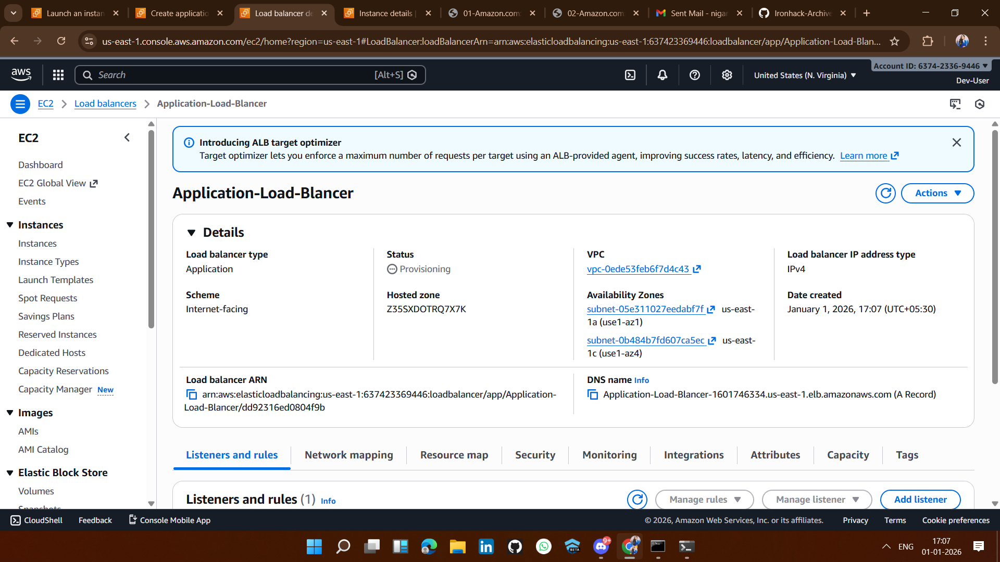

### **STEP : Create ALB**

### 6️⃣ Deploy CloudFront Distribution
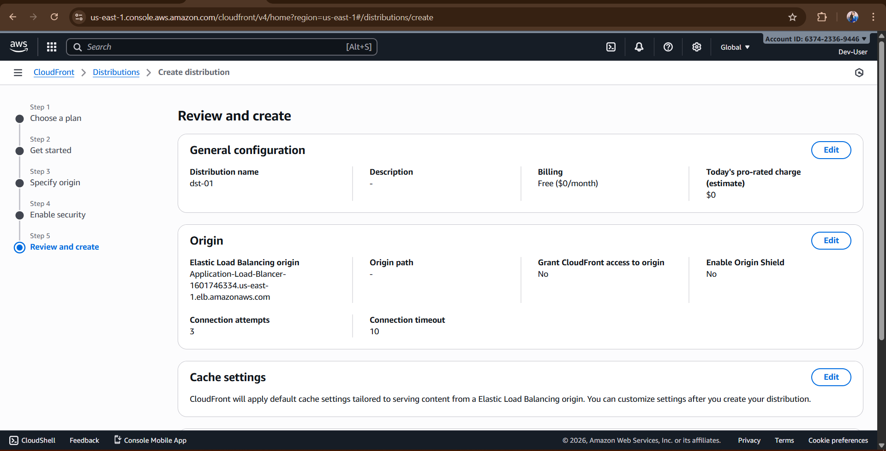

### 7️⃣ S3 Logging Setup: Create Bucket
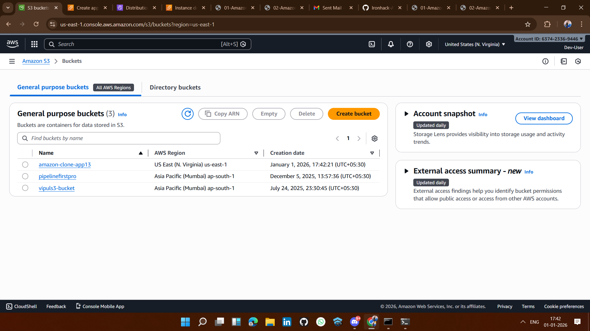

### **STEP : Create Folder for Logs**
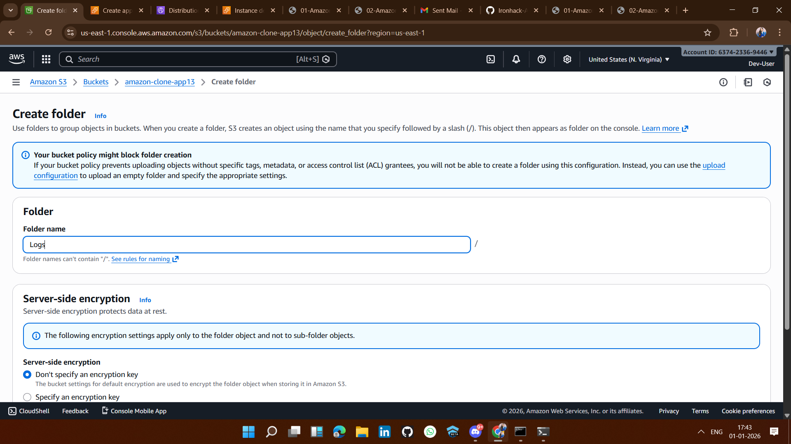

### **STEP : Configure AWS CLI on EC2**

 
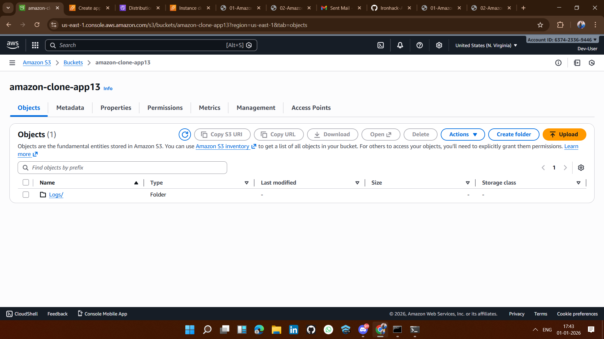 
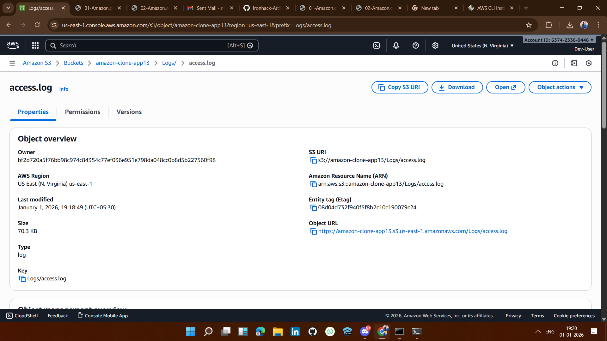 
