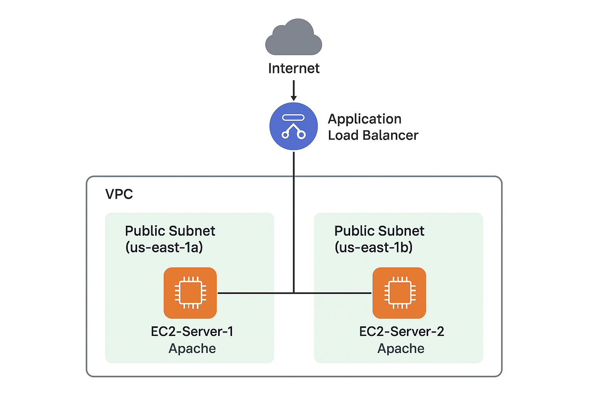

#  Project 1: AWS EC2 Load Balancer Project

## 📘 Project Overview

This project demonstrates how to deploy two EC2 instances behind an Application Load Balancer (ALB) in AWS. 
The setup ensures high availability, scalability, and automatic health monitoring of the web servers. 

The Load Balancer distributes incoming HTTP traffic evenly across multiple EC2 instances hosted in different Availability Zones.Application Load Balancer uses the Round Robin routing algorithm by default, which means: 
✅ Each new incoming request is forwarded to the next available EC2 instance in sequence. 
✅ This helps distribute traffic evenly between all healthy targets, preventing overloading any single instance.

## 🏗️ Architecture Diagram

Below is the architecture diagram representing the project setup:

                ┌────────────────────────────┐
                │      Internet Client       │
                └─────────────┬──────────────┘
                              │ HTTP Request (Port 80)
                              ▼
                  ┌────────────────────────────┐
                  │   Application Load Balancer │
                  └─────────────┬──────────────┘
                     /                        \
        ┌──────────────────┐         ┌──────────────────┐
        │   EC2 Instance 1 │         │   EC2 Instance 2 │
        │ (us-east-1a)     │         │ (us-east-1b)     │
        └──────────────────┘         └──────────────────┘

## ⚙️ Technologies Used

1️⃣ Amazon EC2 – to host web servers 
2️⃣ Application Load Balancer (ALB) – to distribute traffic 
3️⃣ Target Group – to define EC2 instances for load balancing 
4️⃣ Security Groups – to control inbound/outbound traffic 
5️⃣ VPC and Subnets – for network isolation and availability zones

## 🪜 Step-by-Step Implementation

## 1. Launch EC2 Instances

Launch two EC2 instances using Ubuntu AMI.
<pre>
******** Install and configure a simple web server: ********
# !/bin/bash 
sudo yum update -y
sudo yum install httpd -y
sudo systemctl start httpd
sudo systemctl enable httpd
echo "Welcome to EC2-Server-1">/var/www/html/index.html
</pre>

(Repeat for the second instance and change the text to “EC2-Server-2”)
Ensure both instances are in different Availability Zones (e.g., us-east-1a and us-east-1b).

## 2. Create a Target Group
<pre>
Navigate to EC2 → Target Groups → Create Target Group.
Step 1: Target type: Instance
Step 2: Target group name
Step 2: Protocol: HTTP
Step 3: Port: 80
Step 4: IP address type: IPv4
Step 5: Select VPC: default 
Step 5: Protocol version: HTTP1
<h2>Health checks</h2>
Step 6: Health check protocol: HTTP
Step 7: Health check path: /index.html 

Register both EC2 instances to the Target Group.
</pre>

## 3. Create an Application Load Balancer
<pre>
Go to EC2 → Load Balancers → Create Load Balancer → Application Load Balancer.

Step1: Load balancer name: ALB
Step2: Scheme: Internet-facing
Step3: Load balancer IP address type: IPv4
Step 4: VPC: default
Step4 : Select at least two subnets (us-east-1a and us-east-1b).
Step5: Security group: Allow HTTP (port 80).
Step6: Listener: Protocol – HTTP, Port – 80.
Step7: Default action: Forward to your Target Group.
Step 8: Select Target group
</pre>

## 4. Verify Health Checks
<pre>
Step1: Go to the Target Group → Targets tab.
Step2: Wait until both targets show Healthy status.
Step3: If you see Unused or Unhealthy, ensure:
 ⬜ Both instances are in the same VPC as the load balancer.
 ⬜ Correct Availability Zones are enabled in the load balancer settings.
 ⬜ The Security Group allows inbound HTTP (port 80) traffic.
</pre>

## 5. Test the Load Balancer
<pre>
⬜ Copy the DNS name of your Load Balancer.
⬜ Paste it into a web browser.
⬜ Refresh multiple times — you should see both EC2 servers responding alternately:</pre>

<pre>
Example output:
Welcome to EC2-Server-1
Welcome to EC2-Server-2
</pre>

# 🧾 Author

## Khushi Nigam
AWS EC2 & Load Balancer Project | Cloud & DevOps Learner