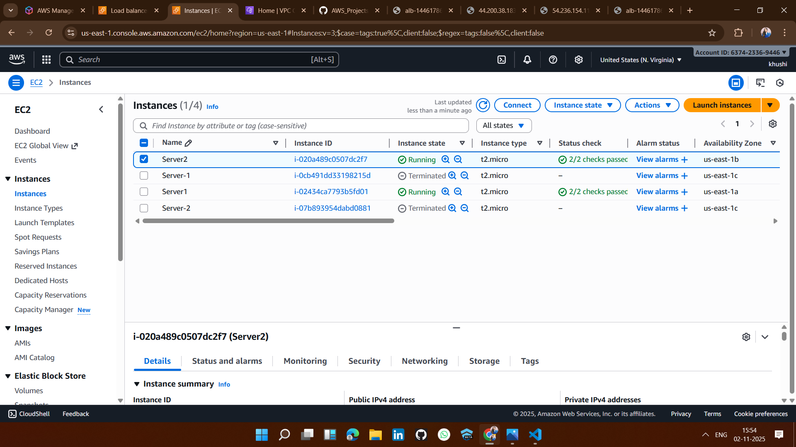
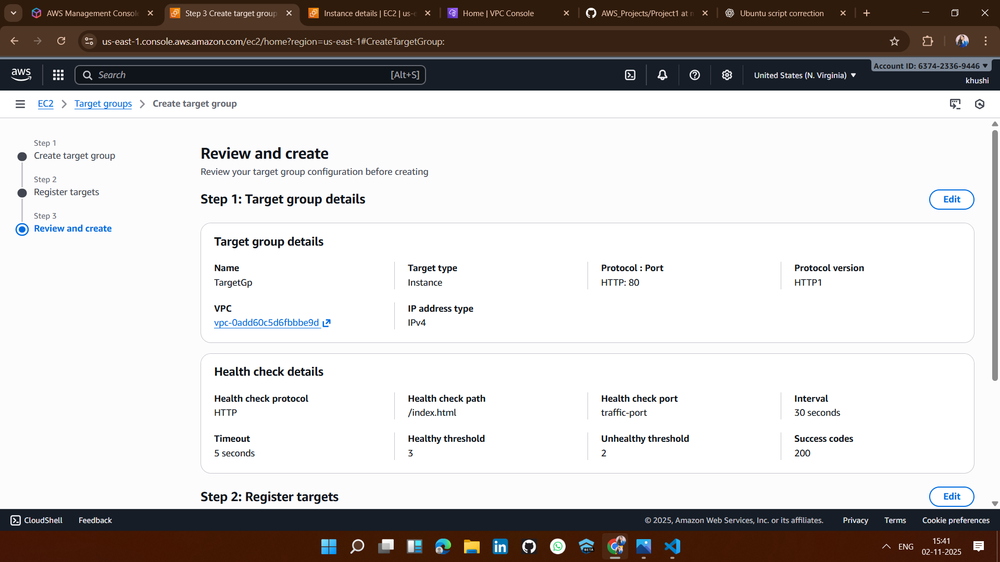
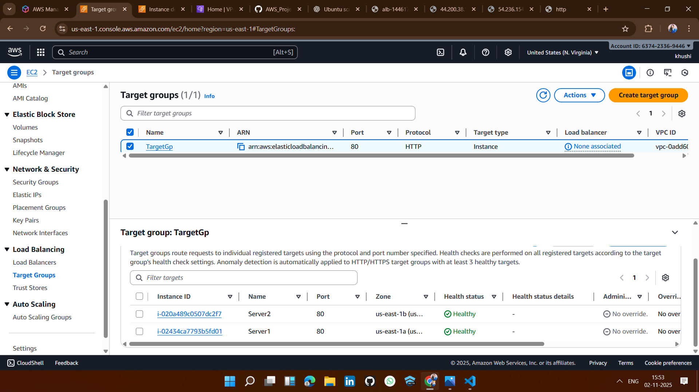
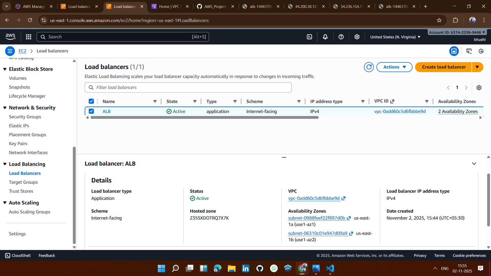
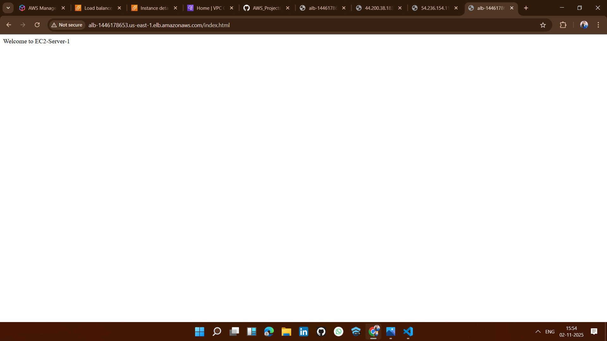

#  Solution: AWS EC2 Load Balancer Project

## ✅ 1. Launch EC2 Instances (in Different Availability Zones) 💻

## ✅ 2. Create a Target Group🎯

## ✅ 3. Create an Application Load Balancer (ALB)⚖️

## ✅ 4. Verify Health Checks💚
 

## ✅ 5. Test the Load Balancer 🌐

## After Refreshing the Load Balancer Page

## Note: 
When I refresh the Load Balancer DNS in the browser, it alternates between Server 1 and Server 2 — this confirms that the Application Load Balancer is distributing traffic using the Round Robin method. 🔁