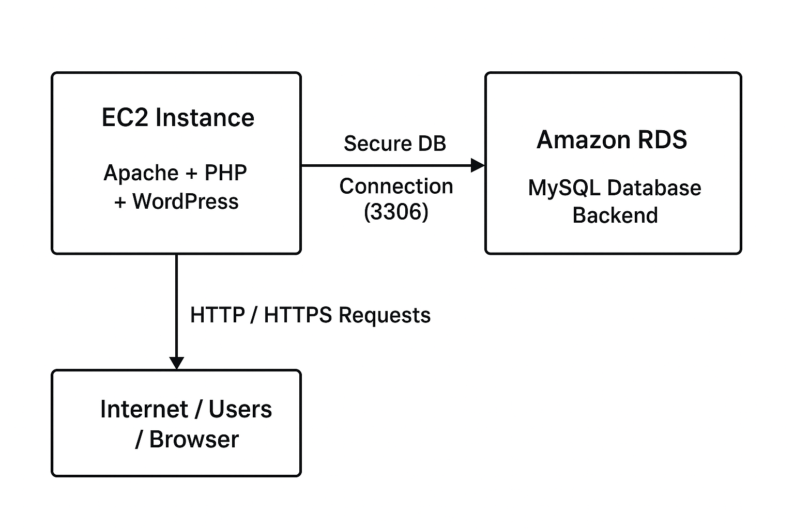

# 🚀 Project 10: WordPress Hosting on AWS EC2 and RDS (MySQL)
## 📘 Project Overview

This project demonstrates how to deploy a fully functional, scalable, and secure WordPress application on Amazon Web Services (AWS) using EC2 for compute and Amazon RDS (MySQL) for database management.
By separating the application layer (EC2) and database layer (RDS), this architecture ensures improved performance, high availability, and easier maintenance—making it suitable for production-grade environments.

## ⚙️ Technologies Used
<pre>
1️⃣ Amazon EC2 – Virtual compute instance used to host the WordPress application 
2️⃣ Amazon RDS (MySQL) – Managed relational database service used to store WordPress data 
3️⃣ Amazon VPC & Subnets – Network infrastructure enabling secure communication between EC2 and RDS 
4️⃣ Security Groups – Firewall rules controlling inbound and outbound traffic
5️⃣ Apache Web Server – HTTP server used to run the WordPress application 
6️⃣ PHP & Required Extensions – Backend scripting language for WordPress execution 
7️⃣ Linux (Ubuntu/Amazon Linux) – Operating system on EC2 for hosting WordPress 
8️⃣ SSH – Secure shell protocol used to access and configure the EC2 instance 
9️⃣ AWS Management Console – Interface used for provisioning & managing cloud resources
</pre>

## 🏗️ Architecture Diagram
<Pre>
                     +----------------------------------+
                     |        Amazon RDS (MySQL)         |
                     |   WordPress Database Backend      |
                     +------------------+-----------------+
                                        |
                                        |  Secure DB Connection (3306)
                                        |
        -----------------------------------------------------------------
        |                                                               |
+------------------------------+                     +------------------------------+
|        EC2 Instance          |                     |     (Optional: Future)       |
|  Apache + PHP + WordPress    |                     |   EC2 Instance / AutoScale   |
|  Application Server Layer    |                     |   For High Availability      |
+---------------+--------------+                     +------------------------------+
                |
                |  HTTP / HTTPS Requests
                |
    +----------------------------------------+
    |        Internet / Users / Browser      |
    +----------------------------------------+

   → WordPress application runs on EC2 (Apache + PHP)
   → All WordPress database queries go directly to RDS
   → RDS stores posts, pages, users, settings, media metadata
</pre>

# 🪜 Step-by-Step Implementation (WordPress on EC2 + RDS)

## ✅ 1. Create an Amazon RDS (MySQL) database
<pre> 
AWS Console → Services → RDS → Create database 
▪ Engine: MySQL 
▪ Template: Sandbox
▪ DB instance identifier: MySqlDB
▪ Master username: admin
▪ Master password: StrongPassword123! 
▪ DB instance size: db.t3.micro (or as required) 
▪ Storage: 20 GB (auto-scaling optional) 
▪ Connectivity: 
- VPC: same VPC as EC2 
- Public access: No (keep private) 
- Subnet group: use private subnets (multi-AZ for HA recommended) 
- VPC security group: create rds-sg (see Step 3) 
▪ Additional configuration: enable automatic backups, set backup retention (e.g., 7 days) 
▪ Create database: WordPressDB </pre>

## ✅ 2. Launch an EC2 instance (Web server)
<pre> 
AWS Console → Services → EC2 → Launch Instance 
▪ AMI: Amazon Linux 2023 kernel-6.1 AMI
▪ Instance Type: t2.micro (or as required) 
▪ Key pair: EFSFile
▪ Network: Select correct VPC & subnet (same VPC as RDS) 
▪ Storage: 20 GB (adjust as needed) 
▪ Security Group: create a web-server SG (see Step 3 for rules)  
▪ Launch the instance </pre>

## ✅ 3. Create / configure Security Groups
<pre> 
1) Web Server Security Group (web-sg) 
▪ Inbound rules: 
- HTTP → TCP 80 → 0.0.0.0/0 (or restrict to expected clients) 
- HTTPS → TCP 443 → 0.0.0.0/0 (if using SSL) 
- SSH → TCP 22 → Your-IP/32 (restrict to your IP) 
- (Optional) Custom TCP → 8210 → internal monitoring IPs 
▪ Outbound: Allow all (default)
2) RDS Security Group (rds-sg) 
▪ Inbound rules: 
- MySQL/Aurora → TCP 3306 → Source: web-sg (allow only the web server SG) 
▪ Outbound: Allow all or restrict to web-sg Notes:
 - Use security-group IDs as source for RDS inbound (safer than IPs). 
 - If you have multiple app servers, include their SGs as allowed sources for 3306. 
</pre>

## ✅ 4. SSH into EC2 and install LAMP stack (Ubuntu example)
<pre> ssh -i "key.pem" ubuntu@EC2_PUBLIC_IP 
sudo -s 
sudo apt install -y 
apache2 php php-mysql php-xml php-gd php-curl php-mbstring unzip # (Optional) For Amazon Linux: 
# sudo yum update -y 
# sudo amazon-linux-extras enable php8.0 
# sudo yum install -y php php-mbstring php-xml php-gd php-mysqlnd httpd 
# Start & enable Apache sudo systemctl enable --now apache2 
# For Amazon Linux use: sudo systemctl enable --now httpd 
# Create web root 
sudo mkdir -p /var/www/html 
sudo chown -R ubuntu:www-data /var/www/html 
sudo chmod -R 755 /var/www/html </pre>

## ✅ 5. Download and configure WordPress
<pre> 
# Download WordPress 
cd /tmp wget https://wordpress.org/latest.zip 
unzip latest.zip 
# Copy files to web root sudo rsync -avP /tmp/wordpress/ /var/www/html/ 
# Set permissions sudo chown -R www-data:www-data /var/www/html
sudo find /var/www/html -type d -exec chmod 755 {} \;
sudo find /var/www/html -type f -exec chmod 644 {} \; # Prepare wp-config.php 
cd /var/www/html 
sudo mv wp-config-sample.php wp-config.php 
sudo nano wp-config.php # Edit DB settings in wp-config.php: 
define('DB_NAME', 'your_rds_db_name'); 
define('DB_USER', 'wp_admin'); 
define('DB_PASSWORD', 'YourRDSPassword'); 
define('DB_HOST', 'your-rds-endpoint.rds.amazonaws.com'); 
# Save and exit, 
then restart apache 
sudo systemctl restart apache2 </pre>

## ✅ 6. Complete WordPress installation via browser
<pre> 
▪ Open browser: http://EC2_PUBLIC_IP (or your domain) 
▪ WordPress setup page appears: - Site Title - Admin Username & Password (create strong creds) - Admin Email 
▪ Finish installation and login to WP Admin </pre>

## ✅ 7. Optional Enhancements (scale & harden)
<pre> 
▪ Use an Application Load Balancer (ALB) + Auto Scaling Group (ASG) for EC2 instances 
▪ Store uploads on Amazon S3 (use WP Offload Media) or mount shared EFS for wp-content 
▪ Use CloudFront as CDN for static assets ▪ Use WAF to protect from common web attacks 
▪ Configure security headers (CSP, HSTS) and fail2ban on EC2 for SSH protection </pre>

## ✅ 8. Final verification
<pre> 
▪ Visit site over HTTPS and test login, media upload, and page creation 
▪ Check RDS connection from EC2: mysql -h your-rds-endpoint -u wp_admin -p 
▪ Verify backup snapshots exist and restore test (for safety) </pre>

# 👩‍💻 Author
## Khushi Nigam
WordPress Hosting on AWS EC2 and RDS (MySQL) Project | Cloud & DevOps Learner