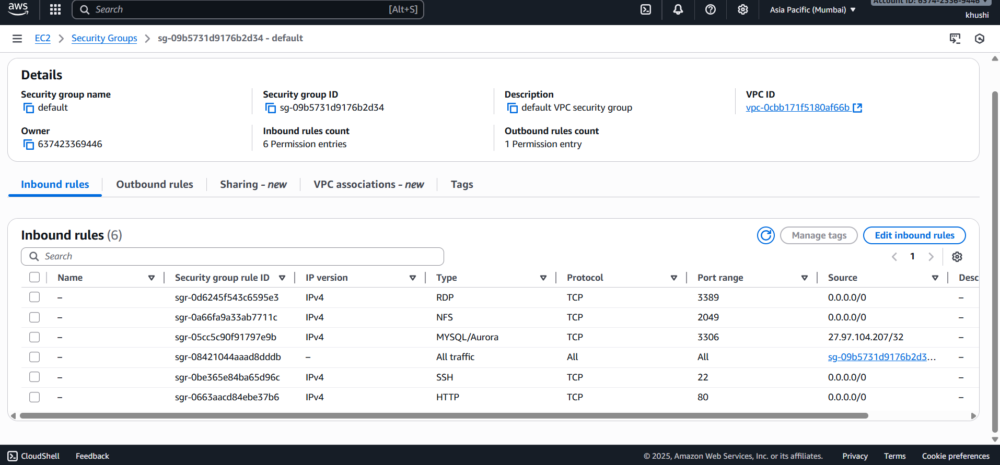
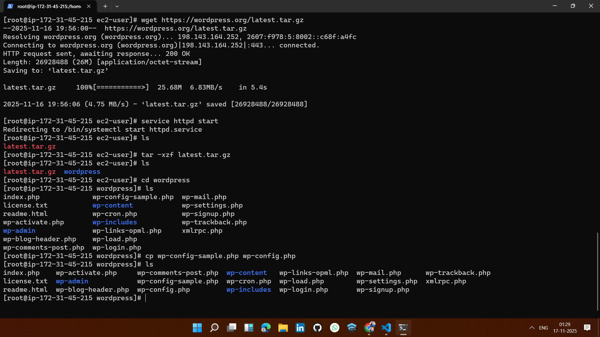
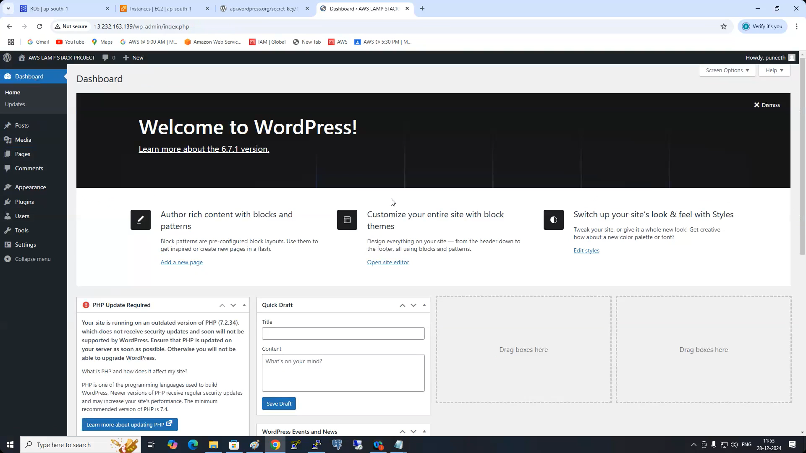

# 🚀 Project 9: AWS EFS Mount on EC2 Instances (Step-by-Step Implementation)

# 🪜 Step-by-Step Implementation (WordPress on EC2 + RDS)

## ✅ 1. Create an Amazon RDS (MySQL) database

## ✅ 2. Launch an EC2 instance (Web server)

## ✅ 3. Create / configure Security Groups

## ✅ 4. SSH into EC2 and install 

## ✅ 5. Download and configure WordPress
.png)

## ✅ 7. Final verification

