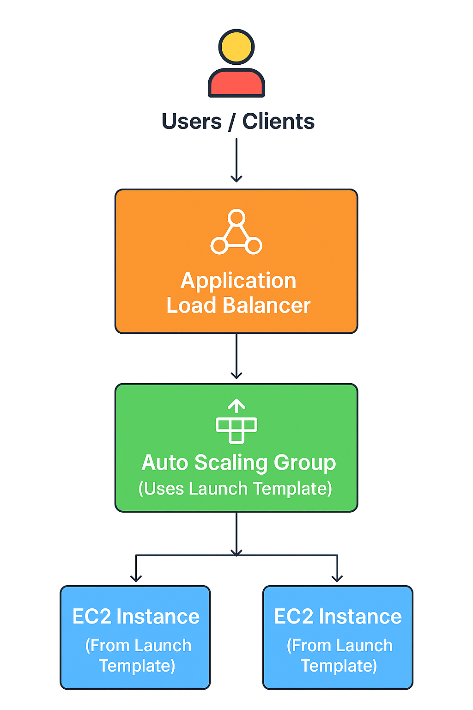

# 🚀 Project 2: Auto Scaling in AWS EC2 using Launch Templates with Load Balancer Integration

## 📘 Project Overview

This project demonstrates **Auto Scaling and Load Balancing** of EC2 instances in AWS using **Launch Templates**.  
The goal is to automatically maintain application availability and distribute incoming traffic evenly across multiple instances using a 

**Load Balancer**.  
When demand increases, **Auto Scaling** launches new EC2 instances automatically, and when demand decreases, it terminates the unnecessary ones — optimizing both **performance** and **cost**.

## 🏗️ Architecture Diagram
<Pre>
            ┌─────────────────────────────┐
            │         Users / Clients     │
            └──────────────┬──────────────┘
                           │
                           ▼
            ┌─────────────────────────────┐
            │ Application Load Balancer   │
            └──────────────┬──────────────┘
                           │
                           ▼
            ┌─────────────────────────────┐
            │     Auto Scaling Group      │
            │ (Uses Launch Template)      │
            └──────────────┬──────────────┘
                           │
          ┌────────────────┴────────────────┐
          ▼                                 ▼
┌────────────────────┐           ┌────────────────────┐
│   EC2 Instance #1  │           │   EC2 Instance #2  │
│ (From Launch Temp) │           │ (From Launch Temp) │
└────────────────────┘           └────────────────────┘
</pre>

## ⚙️ Technologies Used
<pre>
1️⃣ **Amazon EC2** – to host scalable web servers  
2️⃣ **Launch Template** – to define instance configurations  
3️⃣ **Auto Scaling Group** – to automatically scale EC2 instances  
4️⃣ **Application Load Balancer (ALB)** – to distribute traffic  
5️⃣ **Target Group** – to route requests to healthy instances  
6️⃣ **Amazon SNS** – for Auto Scaling notifications  
7️⃣ **VPC & Subnets** – for networking and multi-AZ architecture  
</pre>

## 🪜 Step-by-Step Implementation

## ✅ 2. Create a Target Group
▪ Go to EC2 → Target Groups → Create Target Group
▪ Choose:
Target type: Instance
Protocol: HTTP
Port: 80
▪ Health Check Path: /
▪ Register targets (EC2 instances will be automatically attached later by Auto Scaling).

## ✅ 3. Create an Application Load Balancer (ALB)
<pre>
▪ Go to Load Balancers → Create Load Balancer → Application Load Balancer
▪ Choose:
Scheme: Internet-facing
IP type: IPv4
Select at least two subnets (from different AZs)
▪ Add a Listener:
Protocol: HTTP
Port: 80
Default Action: Forward to Target Group
</pre>

✅ 4. Create an Auto Scaling Group (ASG)
<pre>
▪ Go to EC2 → Auto Scaling Groups → Create
▪ Choose:
Launch Template: Template-For-Pro1
VPC: same as the ALB
Subnets: select multiple AZs (e.g., us-east-1a & us-east-1b)
▪ Integrate with Load Balancer:
Attach existing Target Group (AWS-TG)
▪ Group size:
Desired: 2
Minimum: 1
Maximum: 4
 ▪ Health Check Type: EC2 + ELB
 ▪ Enable Notifications (Optional) via SNS.
</pre>

✅ 5. Verify Setup

▪ Wait until your targets show Healthy under the Target Group.
▪ Access the ALB DNS Name in your browser:
<pre>
http://your-load-balancer-name.us-east-1.elb.amazonaws.com/
</pre>

Every refresh will show responses from different EC2 instances:
<pre>
Welcome to Auto Scaled Instance - ip-172-31-8-45
Welcome to Auto Scaled Instance - ip-172-31-12-33
</pre>

## 👩‍💻 Author
Khushi Nigam
AWS EC2 & Load Balancer Project | Cloud & DevOps Learner