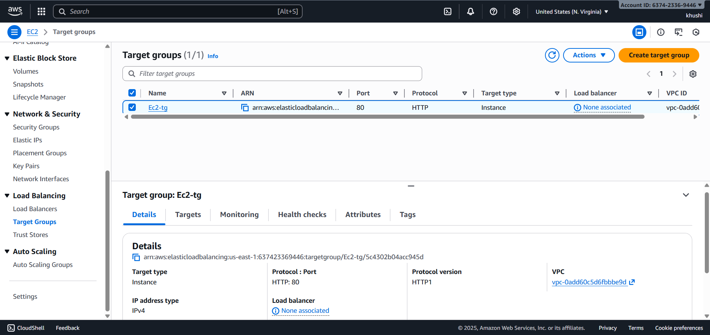
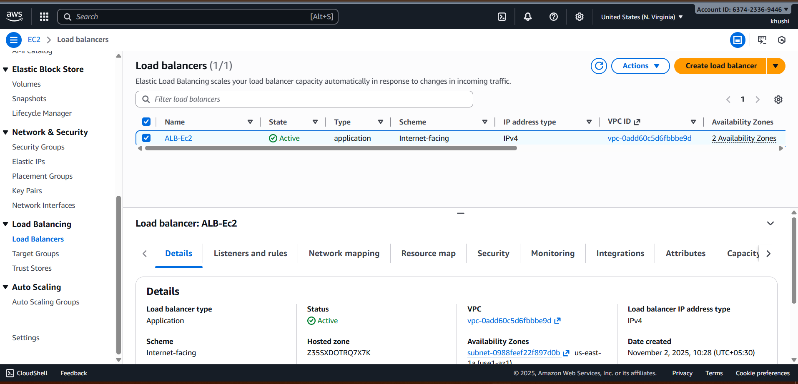
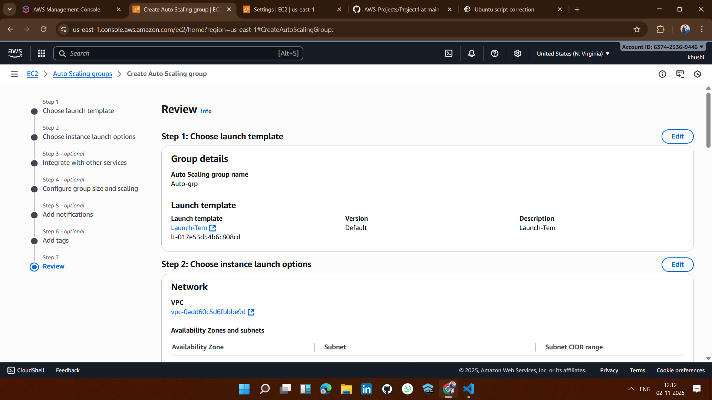
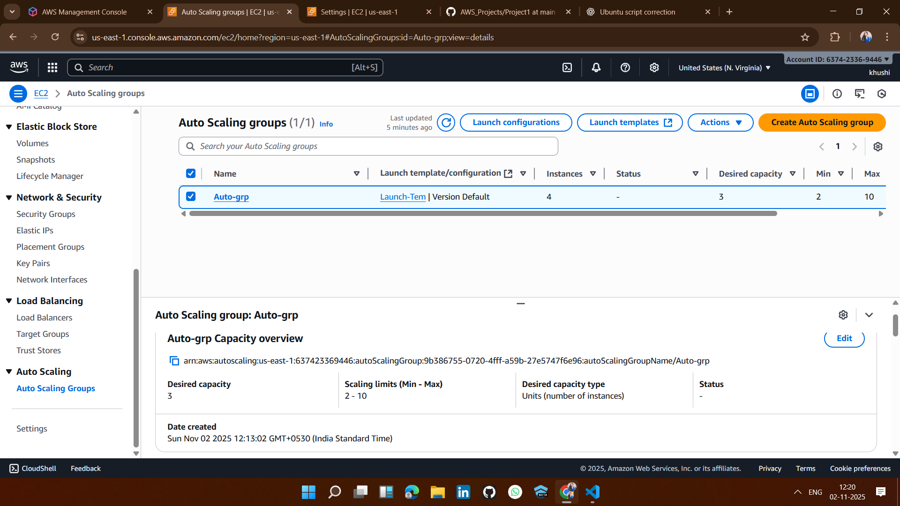
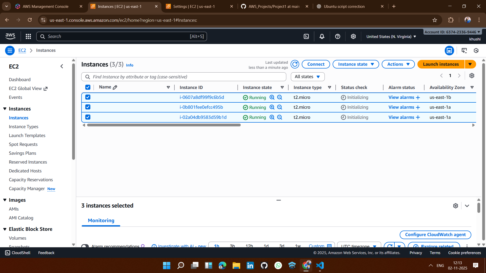
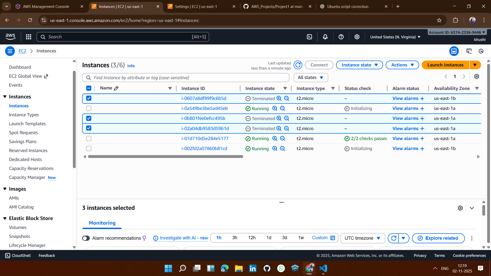

## ✅ 1. Create a Target Group

## ✅ 2. Create an Application Load Balancer (ALB)

## ✅ 3. Create launch template

## ✅ 4. Create an Auto Scaling Group (ASG)
 

## ✅ 4. With template launch ec2 instance 

## ✅ 5. If i delete EC2 instance : 

## 📝 Note:
When I manually terminated (deleted) the EC2 instance, a new instance was automatically launched.
This happened because of the Auto Scaling Group and Load Balancer configuration, which ensure high availability by maintaining the desired number of running instances.