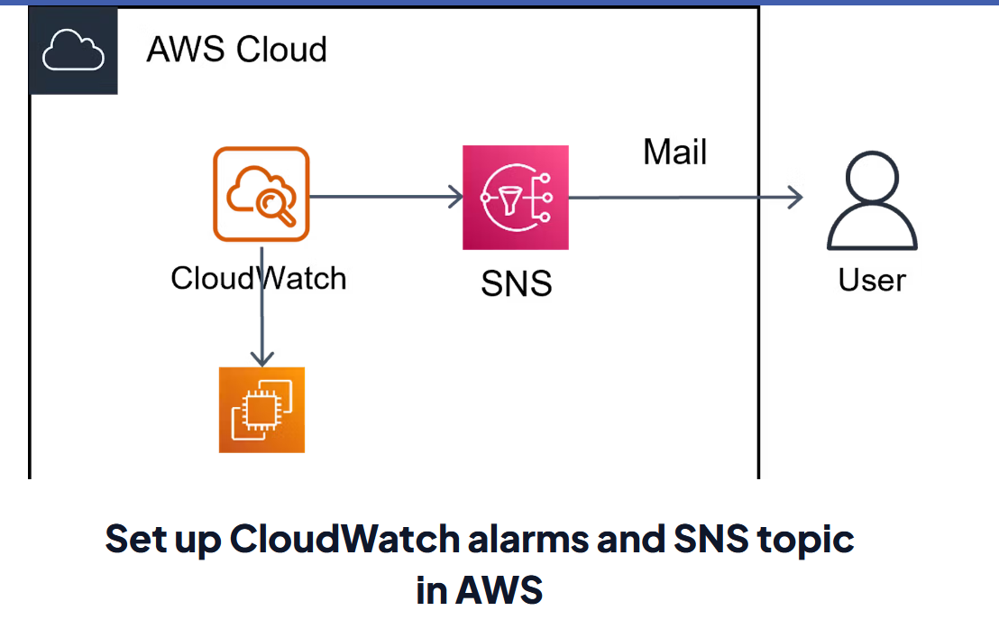

# 🚀 Project 3: Billing alerts with CloudWatch & SNS 

## 📘 Project Overview

This project creates an automated billing-alerting pipeline using AWS CloudWatch and Amazon SNS. When AWS estimated charges cross a configured threshold, CloudWatch emits an alarm which forwards a notification to an SNS topic. Subscribers (email, Slack webhook, Lambda, etc.) receive the alert so ops or finance teams can act quickly to control costs.

## ⚙️ Technologies Used
<pre>
1️⃣ Amazon EC2 (Elastic Compute Cloud)
2️⃣ AWS CloudWatch (Billing Metrics & Alarms) 
3️⃣ Amazon SNS (Topics & Subscriptions)
 
</pre>

## 🏗️ Architecture Diagram
<Pre>
+----------------+ (billing metric)      +-----------------+ (alarm)    +-----------+
| AWS Billing    | --------------------> | CloudWatch      | ---------> | SNS Topic |
| (EstimatedCost)|                       | Alarm           |            +-----+-----+
+----------------+                                           (publish)     |      |
                                                                          Email |   | 
                                                                                v   v
                                                                           nigamkhushi731@gmail.com
</pre>

## 🪜 Step-by-Step Implementation

## ✅ 1. Enable Billing Alerts in AWS 
<pre>
 ▪ Sign in to the AWS Management Console. 
 ▪ Go to the Billing Dashboard → Billing preferences. 
 ▪ Under "Alert preferences", tick “Receive Billing Alerts”.✅
 ▪ Click “Save preferences” to apply the changes.

</pre>

## ✅ 2. Create an SNS Topic
<pre>
⬜ SNS (Simple Notification Service) is used to send alert notifications in a reliable and scalable manner.
Go to SNS Console → Topics → Create Topic
  ▪ Choose Standard 
  ▪ Give a name: BillingAlertTopic
  ▪ Click Create Topic

</pre>

## ✅ 3. Subscribe to SNS Topic
<pre>
⬜ Now you need to subscribe your email ID so that you can receive the alert emails.
  ▪ Under the topic → Click Create Subscription
  ▪ Protocol: Email
  ▪ Endpoint: Your Email Address
  ▪ Click Create Subscription
  ▪ Check your inbox 📧 → Confirm the subscription by clicking the link.
</pre>

## ✅ 4. Create a CloudWatch Alarm for Billing
<pre>
Go to EC2 → Auto Scaling Groups → Create
 ▪ Go to CloudWatch Console → Alarms → Create Alarm
 ▪ Click Select Metric →
   → choose Billing → Total Estimated Charge
 ▪ Select the metric named
   “EstimatedCharges” (Currency = USD or INR)
 ▪ Click Select Metric
</pre>

## ✅ 5. Configure Alarm Conditions
<pre>
▪ Statistic: Maximum
▪ Period: 6 hours (or 1 hour for faster updates)
▪ Threshold type: Static
▪ Condition:
   Greater than 5 (if you want alert above $5)
</pre>

## ✅ 6. Add Notification
<pre>
▪ Send notification to an existing SNS topic → Select your topic BillingAlertTopic
▪ Optionally, add another action if needed.
</pre>

## ✅ 7. Add Alarm Name & Description
<pre>
⬜ Example:
  ▪ Name: Billing_Alert_Above_5USD
  ▪ Description: Send alert when monthly AWS bill exceeds $5

Click Next → Review everything → Click Create Alarm.
</pre>

## ✅ Step 8: Test the Setup
<pre>
You’ll receive an email notification whenever the billing cost crosses the set threshold.
</pre>

# 👩‍💻 Author
## Khushi Nigam
AWS EC2 & Load Balancer Project | Cloud & DevOps Learner