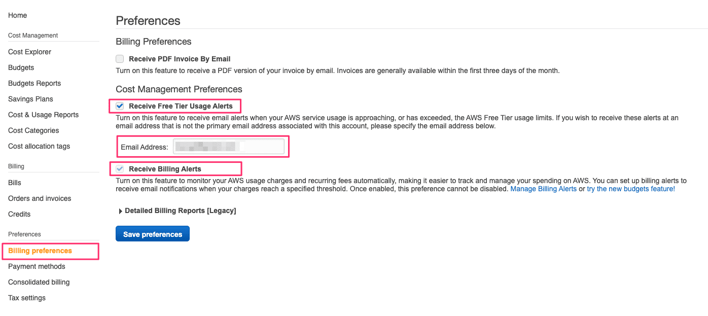
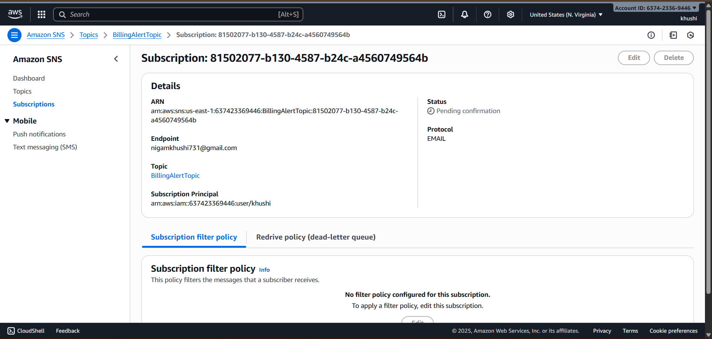
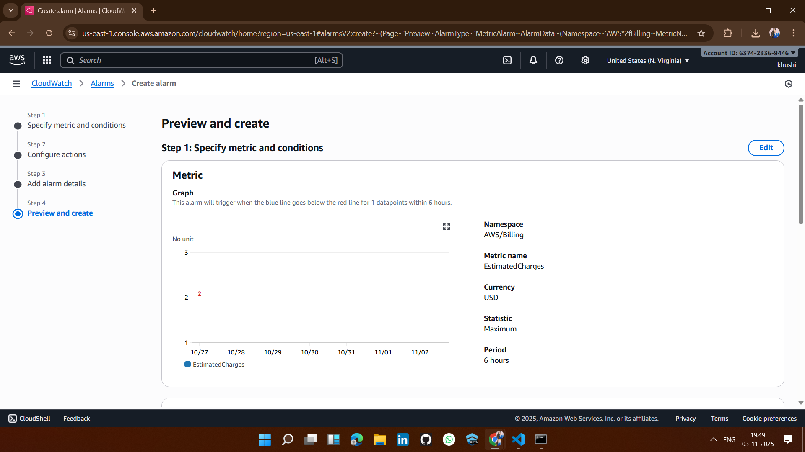

# 🚀 Solution 3: Billing alerts with CloudWatch & SNS 

## ✅ 1. Enable Billing Alerts in AWS 

## ✅ 2. Create an SNS Topic & Subscribe 

## ✅ 3. Create a CloudWatch Alarm for Billing

## ✅ 4. Configure Alarm Conditions

## ✅ 5. Add Notification

## ✅ 6. Add Alarm Name & Description
