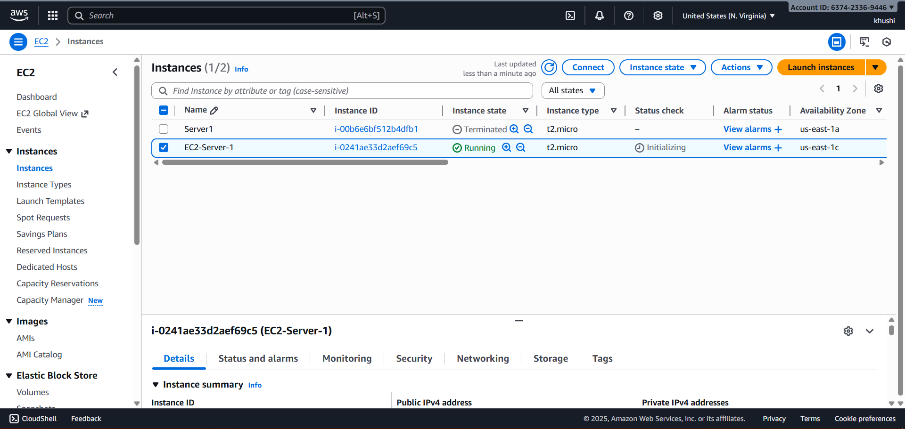
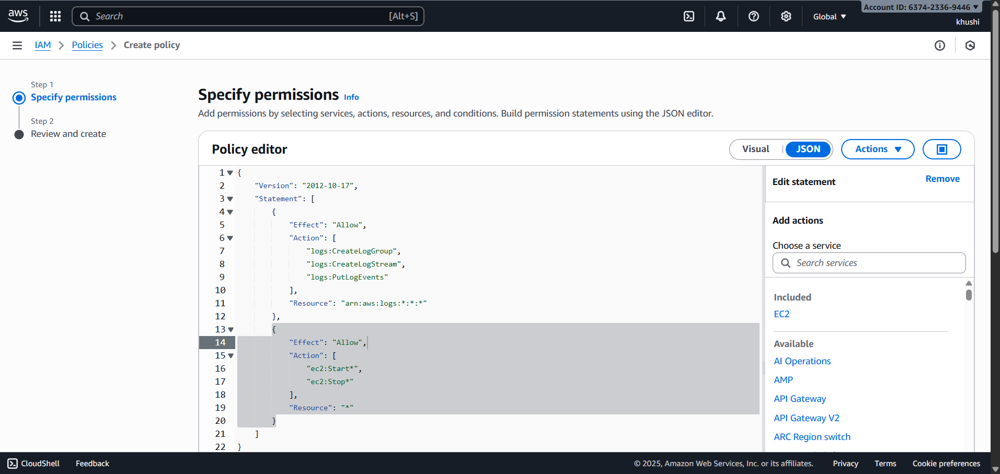
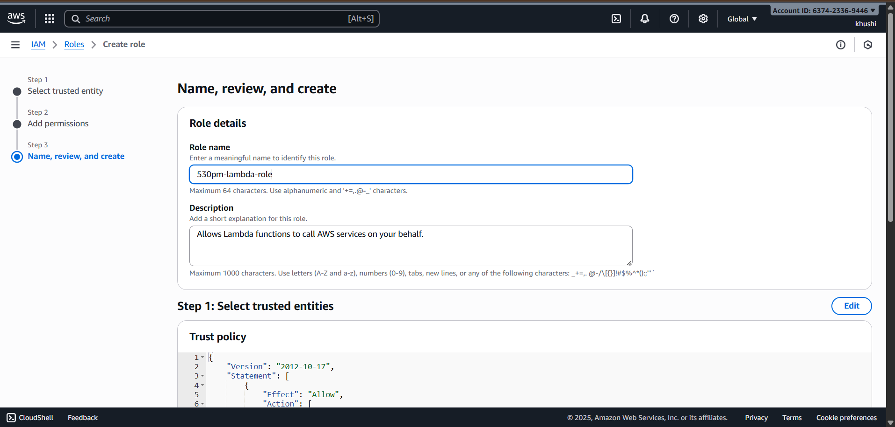
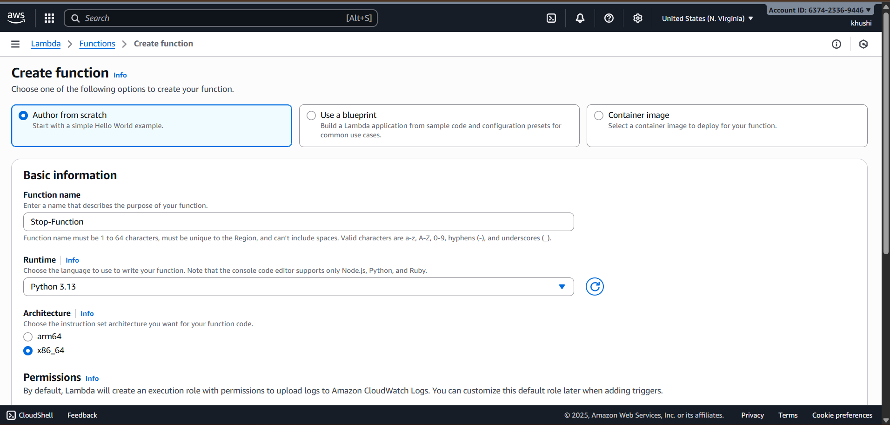
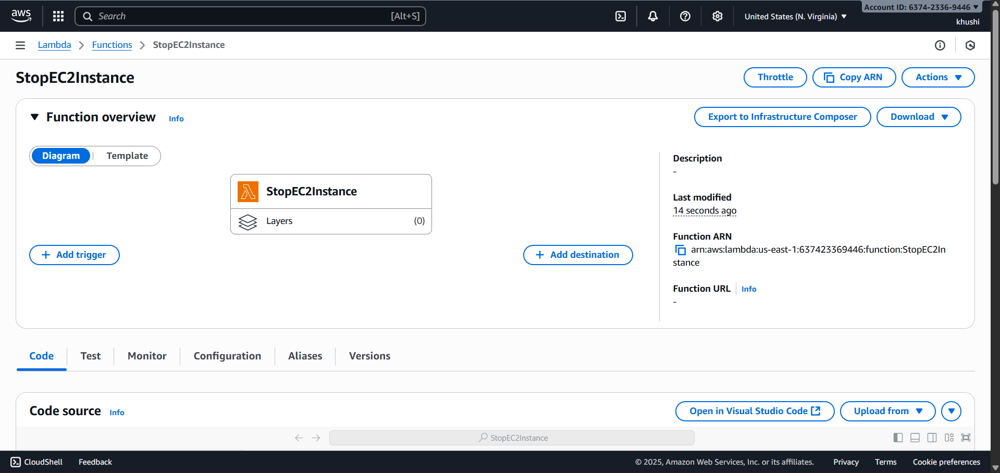
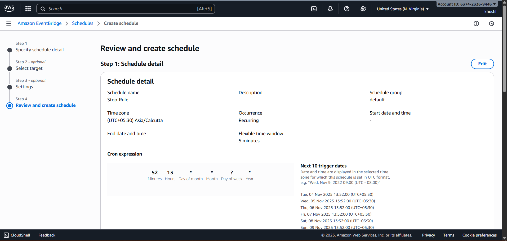
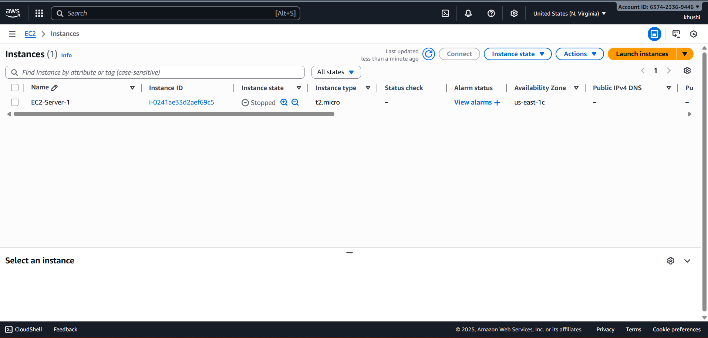

# 🚀 Solution : Automated EC2 Instance Scheduler using AWS Lambda & EventBridge (For Cost Optimization)

## 🪜 Step-by-Step Implementation

## ✅ 1. Launch EC2 instance 

## ✅ 2. Create IAM Role and Attach Permissions
## Create Policies

## Create Role

## ✅ 3. Create a Lambda function for stop EC2 instace 

## ✅ 4. Create EventBridge Rule (Scheduler Trigger)

## ✅ 5.Verify the Automation

As you can see, the EC2 instance was successfully stopped by the Lambda function, confirming that the automation works as expected.