# 🚀 Solution : Elastic Beanstalk Environment Migration Project (Java to Python)

## 🪜 Step-by-Step Implementation

# ✅ 1: Create an Elastic Beanstalk Application
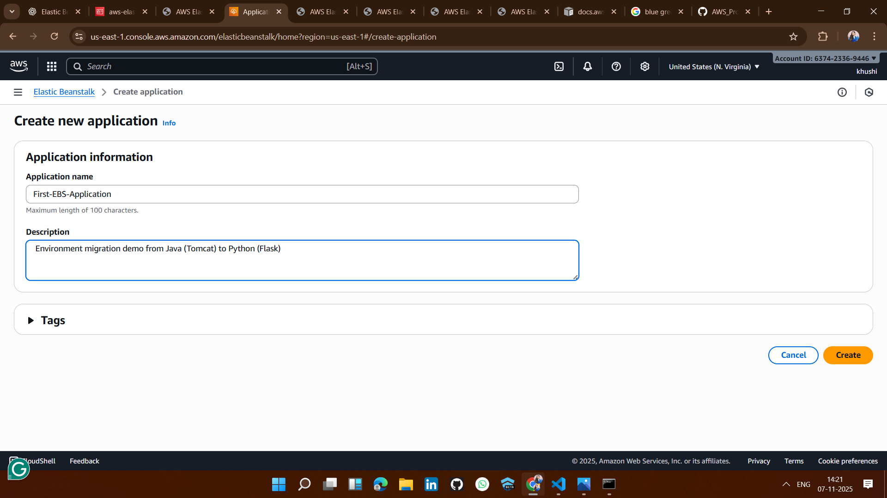

## ✅ 2: Create a Java (Blue) Environment

## ⬜ 1: Configure environment
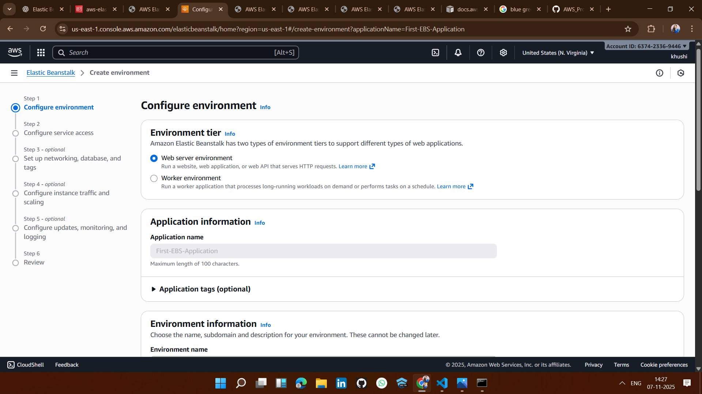

## ⬜ 2: Configure service access
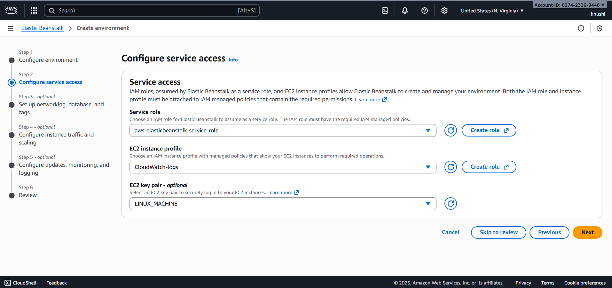

## ⬜ 3: Set up networking, database, and tags (Select default value)
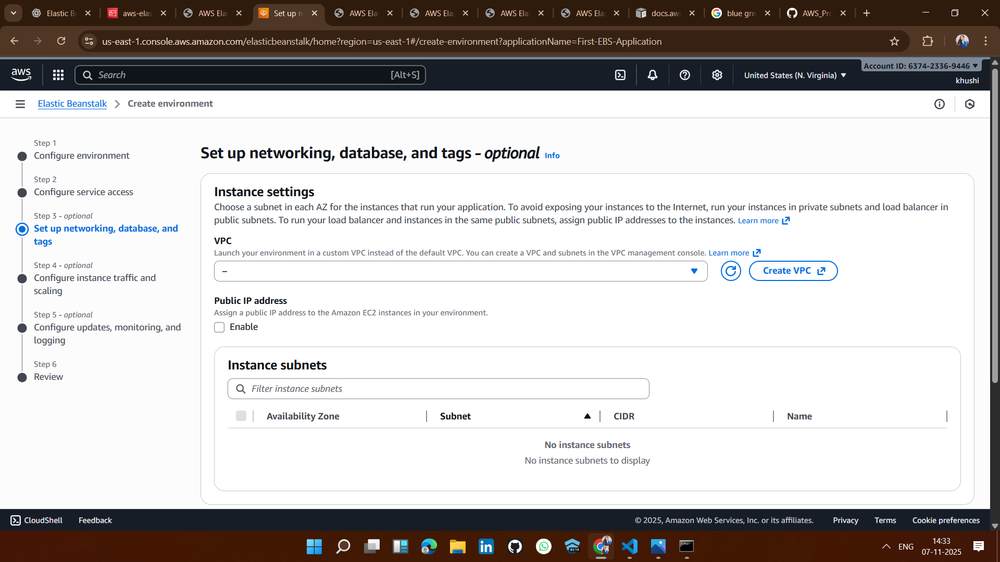

## ⬜ 4: Configure instance traffic and scaling
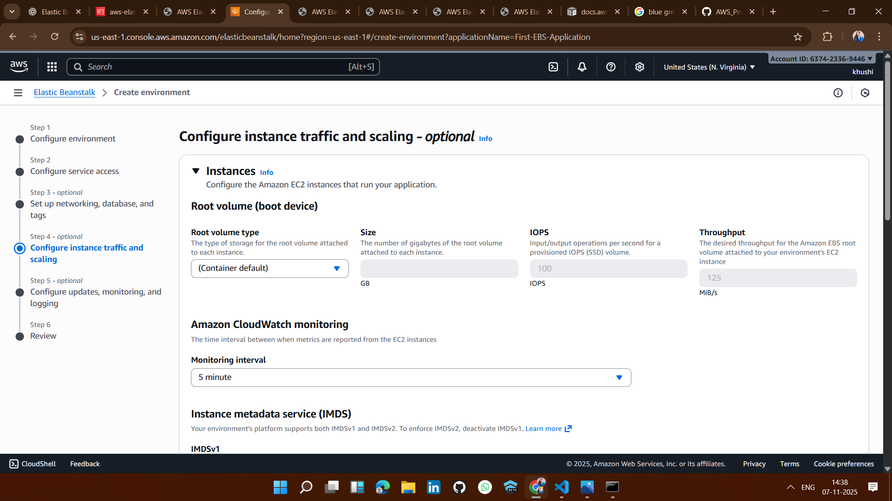

## ⬜ 5: Configure updates, monitoring, and logging
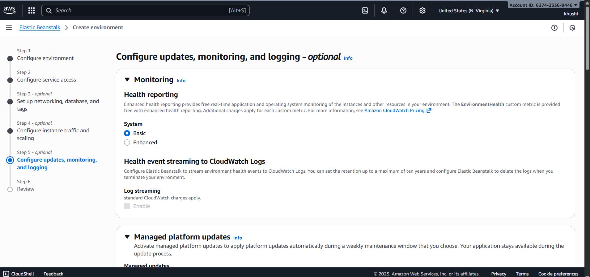

## ⬜ 6: Review Everything and Click on Create
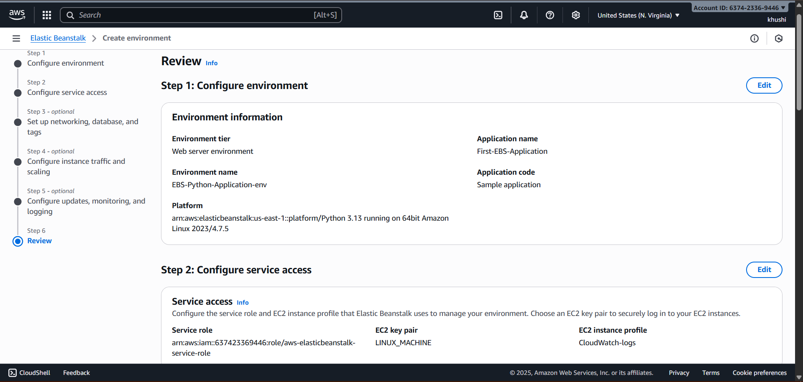

## ✅ STEP 3: Test the Blue Environment
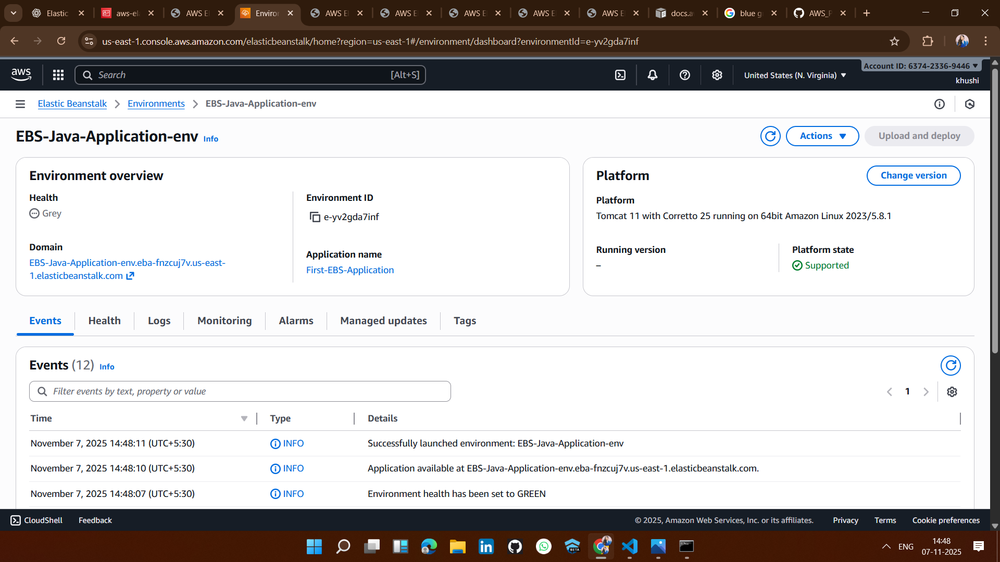
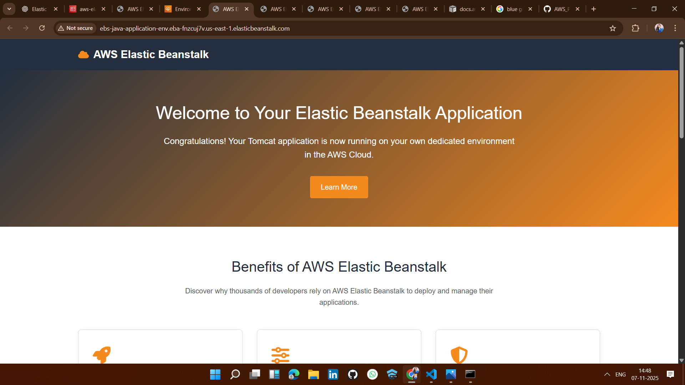

## ✅ STEP 4: Create a Python (Green) Environment for aaplication 
Repeat the same steps as in the Blue environment deployment.

## ✅ STEP 5: Test the Green Environment
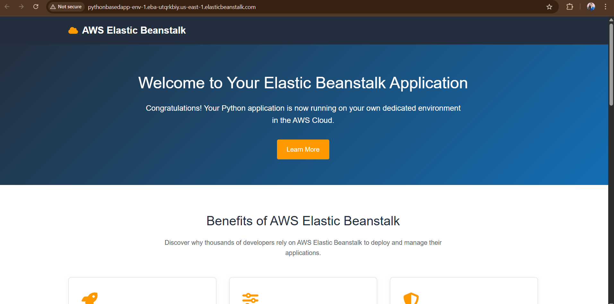

## ✅ STEP 6: Verify Both Environments
You can now see that both environments have been created successfully.
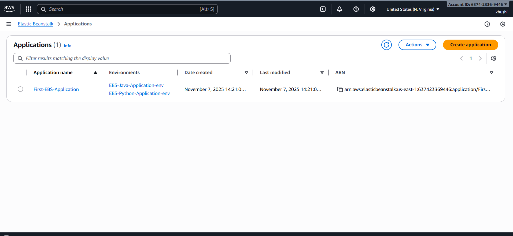
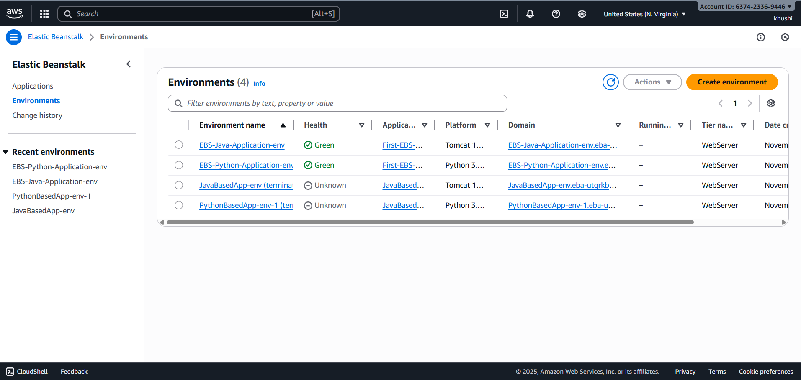

## ✅ STEP 6: Perform Blue-Green Deployment (CNAME Swap)
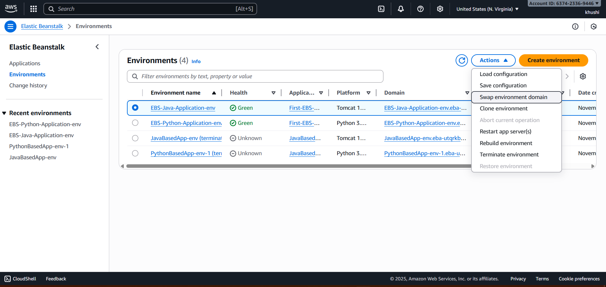
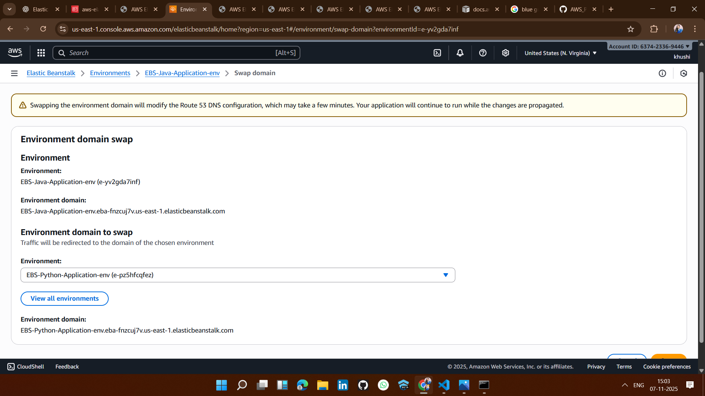

## 🎉 Result:
Successfully completed the environment migration!
After performing the CNAME swap, if you refresh your page, the application will now run using Python (Flask) instead of Java (Tomcat) — with zero downtime.