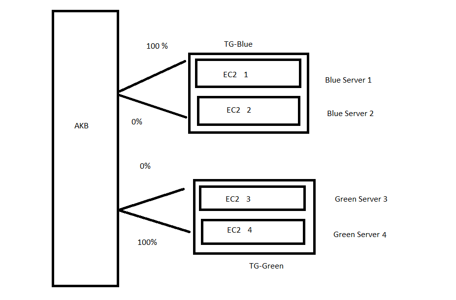

# 🚀 Project 8: EC2 Blue-Green Deployment using ALB (Zero-Downtime Deployment)

## 🎯 Project Overview
Designed and implemented a Blue-Green Deployment architecture on AWS using EC2, Application Load Balancer, and Target Groups. Deployed application versions via automation scripts on separate environments and switched traffic seamlessly using ALB routing rules to achieve zero downtime and easy rollback.

## 🧠 Summary in One Line:

Implemented a Blue-Green Deployment architecture on AWS using EC2 instances, Target Groups, and an Application Load Balancer to achieve zero-downtime application updates. 🚀

## ⚙️ Technologies Used
<pre>
1️⃣ Amazon EC2 (Elastic Compute Cloud): Hosts application servers for Blue (v1) and Green (v2) environments.
2️⃣ AWS Application Load Balancer (ALB): Distributes traffic between Blue and Green target groups and manages traffic switching for zero downtime.
3️⃣ AWS Identity and Access Management (IAM): Grants necessary permissions for EC2, ALB, and deployment scripts.
4️⃣ Shell Script (Bash): Automates application deployment on EC2 instances.
5️⃣ Target Groups: Logical groups of EC2 instances for Blue and Green environments. Traffic routing (100% → 0% / 0% → 100%) is managed here for zero downtime deployment.

</pre>

## 🏗️ Architecture Diagram
                 
                 
                         +----------------------+
                         |      AWS Cloud       |
                         +----------+-----------+
                                    |
                                    |
                                    v
                    +-------------------------------+
                    |  Application Load Balancer    |
                    |  (HTTP :80 / HTTPS :443 + ACM)|
                    +---------------+---------------+
                                    |
                +------------------+------------------+
                |                                     |
         +------v------+                        +-------v------+
         | Target Group |                       | Target Group |
         |   Blue-TG    |                       |   Green-TG   |
         +--------------+                       +--------------+
                |                                     |
        +-------+-----------+                 +----------+-------+
        |   EC2 Instance 1  |                 |   EC2 Instance 3 |
        |   EC2 Instance 2  |                 |   EC2 Instance 4 |
        | (App Version v1)  |                 | (App Version v2) |
        +-------------------+                 +------------------+
                |                                         |
                |<---------- Zero Downtime Switch ------->|
                |             100% → 0%                   |
                                 | '
                                 v                   
                           traffic shift to 
                                 |
                                 v       
                             0% → 100%  

## 🪜 Step-by-Step Implementation

## ✅ STEP 1: Launch EC2 Instances (Blue Environment)
<pre> 
⬜ Sign in to the AWS Management Console → Navigate to EC2 Dashboard. 
    ▪ Click on “Launch Instances”. 
    ▪ Name: Blue-Env-Instance-1, Blue-Env-Instance-2 
    ▪ OS: Amazon Linux 
    ▪ Instance Type: t2.micro 
    ▪ Key Pair: LINUX_MACHINE (or your existing key) 
    ▪ Security Group: Select existing security group
    ▪ User Data: Add deployment script to auto-deploy application (Version 1) 
    ▪ Storage: Default (8–10 GB) ▪ Launch instances and verify they are running. 
💡 These two EC2 instances represent your BLUE environment (current production). 
</pre>

## ✅ STEP 2: Create Target Group for Blue Environment
<pre> 
⬜ Navigate to EC2 → Target Groups → Create Target Group. 
   ▪ Choose Target Type: Instances 
   ▪ Name: BlueTargetGroup
   ▪ Protocol: HTTP 
   ▪ Port: 80 
   ▪ VPC: Default (or select existing) 
   ▪ Health Check Path: /index.html 
   ▪ Health Check Protocol: HTTP 
   ▪ Click “Next”. 
⬜ Register Targets: Select Blue-Env-Instance-1 and Blue-Env-Instance-2 → Add to Blue-TG. 
💡 Blue-TG will receive production traffic initially. 
</pre>

## ✅ STEP 3: Launch EC2 Instances (Green Environment)
<pre> 
⬜ Repeat Step 1 for the Green environment. 
   ▪ Name: Green-Env-Instance-1, Green-Env-Instance-2 
   ▪ Deploy updated version of your application (Version 2) 
   ▪ Same Security Group and Key Pair for consistency. 
💡 These two EC2 instances represent your GREEN environment (new release). 
</pre>

## ✅ STEP 4: Create Target Group for Green Environment
<pre> 
⬜ Navigate to EC2 → Target Groups → Create Target Group. 
   ▪ Choose Target Type: Instances 
   ▪ Name: GreenTargetGroup
   ▪ Protocol: HTTP 
   ▪ Port: 80 
   ▪ Health Check Path: /index.html 
⬜ Register Targets: Select Green-Env-Instance-1 and Green-Env-Instance-2 → Add to Green-TG. 
💡 Green-TG will be used for testing before switching live traffic. 
</pre>

## ✅ STEP 5: Create an Application Load Balancer (ALB)
<pre> 
⬜ Navigate to EC2 → Load Balancers → Create Load Balancer. 
   ▪ Choose: Application Load Balancer 
   ▪ Name: BGALB
   ▪ Scheme: Internet-facing 
   ▪ IP Address Type: IPv4 
   ▪ Listeners: HTTP (80), HTTPS (443) [optional] 
   ▪ Security Group: Allow inbound HTTP and HTTPS 
   ▪ Availability Zones: Select at least 2 subnets
     i) us-east-1b (use1-az2)
     ii) us-east-1c (use1-az4) 
   ▪ Click “Next: Configure Routing”. 
   ▪ Target Group: Both
     i) BlueTargetGroup  Weight: 100%
     ii) GreenTargetGroup   Weight: 0%

   ▪ Create Load Balancer. 
💡 ALB will distribute incoming traffic based on listener rules. 
</pre>

## ✅ STEP 6: Test Both Environments
<pre> 
⬜ Open ALB DNS name (e.g., bluegreen-alb-1234.us-east-1.elb.amazonaws.com) 
   ▪ Initially serves Blue (v1) application. 
   ▪ Verify Green instances separately via their private IPs or curl. 
   ▪ Ensure both versions respond correctly and health checks pass. 
</pre>

## ✅ STEP 7: Switch Traffic (Blue → Green)
<pre> 
⬜ Go to ALB → Listeners → View/Edit Rules. 
   ▪ Edit the default rule or forwarding weight. 
   ▪ Change traffic distribution: - Blue-TG: 100% → 0% - Green-TG: 0% → 100% 
   ▪ Save the configuration. 
💡 All production traffic now flows to Green environment — zero downtime! 
</pre>

## 🧠 Result
✅ Achieved zero-downtime deployment by switching traffic between Blue and Green environments using AWS ALB and Target Groups.

# 👩‍💻 Author
## Khushi Nigam
AWS Elastic Beanstalk Environment Migration Project (Java → Python) | Blue-Green Deployment | Cloud & DevOps Learner