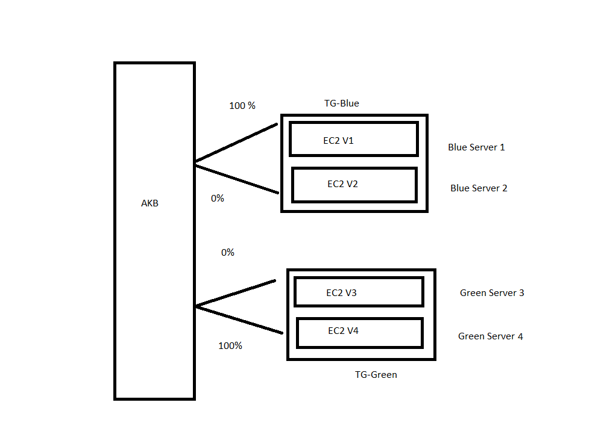

# 🚀 Project 8: EC2 Blue-Green Deployment using ALB (Zero-Downtime Deployment)

## 🎯 Project Overview
Designed and implemented a Blue-Green Deployment architecture on AWS using EC2, Application Load Balancer, and Target Groups. Deployed application versions via automation scripts on separate environments and switched traffic seamlessly using ALB routing rules to achieve zero downtime and easy rollback.

## 🧠 Summary in One Line:

Implemented a Blue-Green Deployment architecture on AWS using EC2 instances, Target Groups, and an Application Load Balancer to achieve zero-downtime application updates. 🚀

## ⚙️ Technologies Used
<pre>
1️⃣ IAM Roles and Policies – To grant Elastic Beanstalk environments necessary permissions for S3, EC2, and CloudWatch.
2️⃣ Elastic Load Balancer (ELB) – To manage traffic between blue and green environments during migration.
3️⃣ Auto Scaling Groups (ASG) – To automatically adjust capacity based on load.

</pre>

## 🏗️ Architecture Diagram
                 
                 
                         +----------------------+
                         |      AWS Cloud       |
                         +----------+-----------+
                                    |
                                    |
                                    v
                    +-------------------------------+
                    |  Application Load Balancer    |
                    |  (HTTP :80 / HTTPS :443 + ACM)|
                    +---------------+---------------+
                                    |
                +------------------+------------------+
                |                                     |
         +------v------+                        +-------v------+
         | Target Group |                       | Target Group |
         |   Blue-TG    |                       |   Green-TG   |
         +--------------+                       +--------------+
                |                                     |
        +-------+-----------+                 +----------+-------+
        |   EC2 Instance 1  |                 |   EC2 Instance 3 |
        |   EC2 Instance 2  |                 |   EC2 Instance 4 |
        | (App Version v1)  |                 | (App Version v2) |
        +-------------------+                 +------------------+
                |                                     |
                |<------ Zero Downtime Switch ------->|
                |       100% → 0%                     |
                             | '
                             v                   
                       traffic shift to 
                             |
                             v       
                         0% → 100%  

🪜 Step-by-Step Implementation

✅ STEP 1: Create an Elastic Beanstalk Application
<pre> 
⬜ Sign in to the AWS Management Console → Navigate to Elastic Beanstalk. 
   ▪ Click on "Create Application". 
   ▪ Application name: First-EBS-Application
   ▪ Description: Environment migration demo from Java (Tomcat) to Python (Flask) 
   </pre>

✅ STEP 2: Create a Java (Blue) Environment
  <pre> 
 Choose recent created application then "Create a new environment". 
⬜ 1: Configure environment
   ▪ Environment tier: Web Server Environment 
   ▪ Application name: by default selected 
   ▪ Environment name: EBS-Java-Application-env 
   ▪ Domain: leave blank  
   ▪ Platform: Tomcat  
   ▪ Application code: Sample application 
   ▪ Presets: Sample application 
   💡 This environment acts as the BLUE environment (current production). 
   </pre>
 
⬜ 2: Configure service access
  <pre>
   ▪ Service role: aws-elasticbeanstalk-service-role (alreday created)  
   ▪ EC2 instance profile: select through dropdown 
   ▪ EC2 key pair: LINUX_MACHINE
   </pre>

⬜ 3: Set up networking, database, and tags (Select default values)

⬜ 4: Configure instance traffic and scaling
  <pre>
   ▪ Root volume type: default   
   ▪ Monitoring interval: 5
   ▪ EC2 security groups: select already selected security group 
   ▪ Environment type: Single instance 
   ▪ Fleet composition: On-Demand instance 
   ▪ Architecture: x86_64
   ▪ Instance types: t2.micro 
   ▪ AMI ID: default value 
   </pre>

⬜ 5: Configure updates, monitoring, and logging
  <pre>
   ▪ System: Basic    
   ▪ Managed updates: uncheckd
   ▪ Email: Enter you email 
   ▪ Rolling updates and deployments: Default   
   ▪ Platform software: default   
   ▪ Source: Default 
   </pre>   

⬜ 6: Review all configurations and click on “Create”.

✅ STEP 3: Create a Python (Green) Environment for aaplication 
   Go back to Elastic Beanstalk → Click “Create Environment” under the same application (JavaBasedApp). 
<pre>   
⬜ 1: Configure environment
   ▪ Environment tier: Web Server Environment 
   ▪ Application name: by default selected 
   ▪ Environment name: EBS-Python-Application-env 
   ▪ Domain: leave blank  
   ▪ Platform: Flask  
   ▪ Application code: Sample application 
   ▪ Presets: Sample application 
   💡 This environment acts as the BLUE environment (current production). 
   </pre>
 
⬜ 2: Configure service access
  <pre>
   ▪ Service role: aws-elasticbeanstalk-service-role (alreday created)  
   ▪ EC2 instance profile: select through dropdown 
   ▪ EC2 key pair: LINUX_MACHINE
   </pre>

⬜ 3: Set up networking, database, and tags (Select default value)

⬜ 4: Configure instance traffic and scaling
  <pre>
   ▪ Root volume type: default   
   ▪ Monitoring interval: 5
   ▪ EC2 security groups: select already selected security group 
   ▪ Environment type: Single instance 
   ▪ Fleet composition: On-Demand instance 
   ▪ Architecture: x86_64
   ▪ Instance types: t2.micro 
   ▪ AMI ID: default value 
   </pre>

⬜ 5: Configure updates, monitoring, and logging
  <pre>
   ▪ System: Basic    
   ▪ Managed updates: uncheckd
   ▪ Email: Enter you email 
   ▪ Rolling updates and deployments: Default   
   ▪ Platform software: default   
   ▪ Source: Default 
   </pre>   

⬜ 6: Review everything and just click on create 
<pre>
   ▪ Service Role & Instance Profile: same as Blue environment.
   💡 This environment will act as the GREEN environment (staging for new version). 
   </pre>

## ✅ STEP 4: Test Green Environment
<pre> 
⬜ Once deployment completes and shows “✅ Healthy”. 
   ▪ Open the environment URL (e.g., JavaBasedApp-green.us-east-1.elasticbeanstalk.com) 
   ▪ Verify Flask app loads successfully. 
   ▪ Test all routes and ensure DB (if any) connectivity is correct. 
   ▪ Compare environment settings between BLUE & GREEN. 
   </pre>

## ✅ STEP 5: Perform Blue-Green Deployment (CNAME Swap)
<pre> 
⬜ Go to Elastic Beanstalk Console → Environments. 
   ▪ Select “Actions” → “Swap environment URLs”. 
   ▪ Choose: Source environment: JavaBasedApp-blue Destination environment: EBS-Python-Application-env (e-pz5hfcqfez)
   ▪ Confirm Swap. 
💡 This swaps the public URLs, directing production traffic to the GREEN environment (Python) with zero downtime. 
</pre>

✅ 7. Clean Up Resources
<pre> 
⬜ After successful verification: 
▪ Terminate the BLUE environment (JavaBasedApp-blue) to save cost. 
▪ Retain S3 buckets and logs if needed. 
▪ Verify only the active GREEN (Python) environment is running.
 </pre>

# 👩‍💻 Author
## Khushi Nigam
AWS Elastic Beanstalk Environment Migration Project (Java → Python) | Blue-Green Deployment | Cloud & DevOps Learner