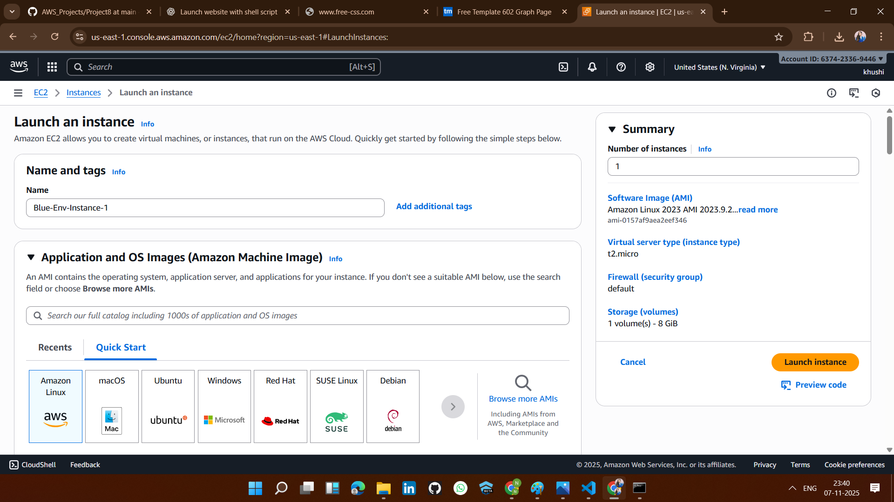
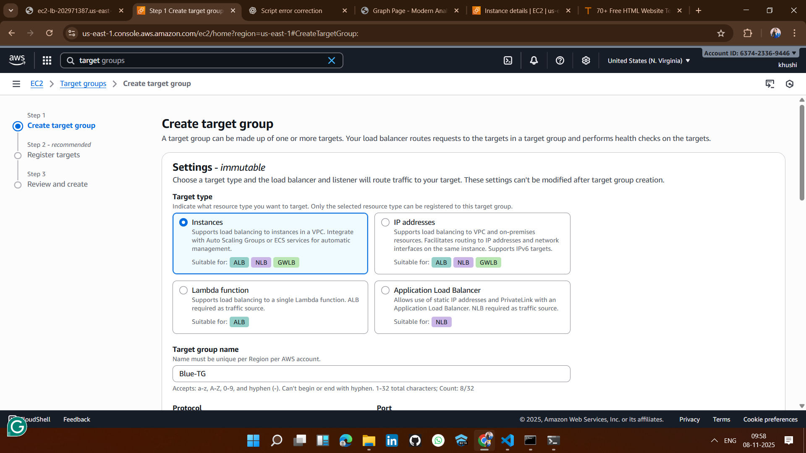
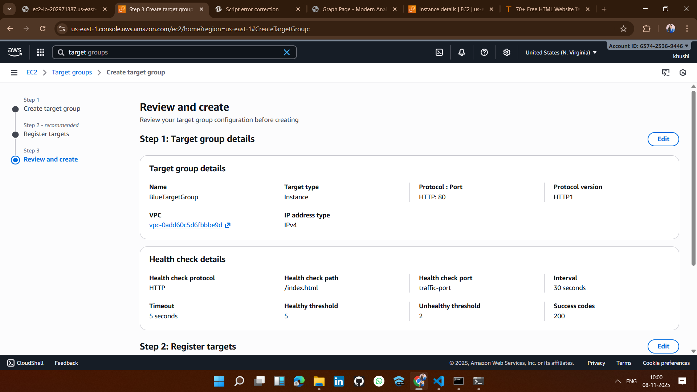
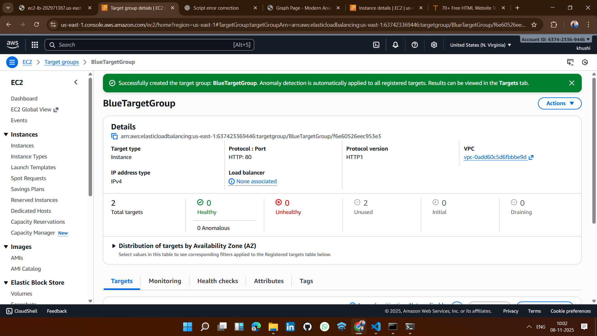
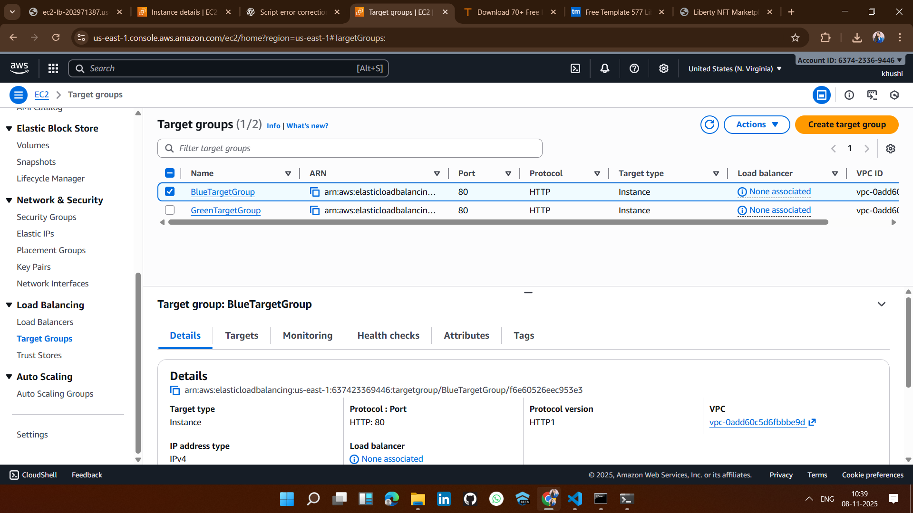
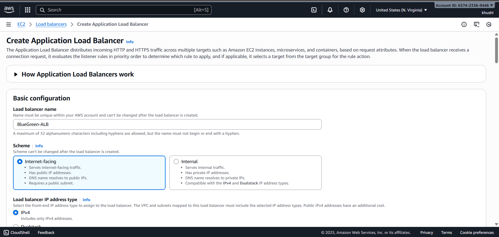
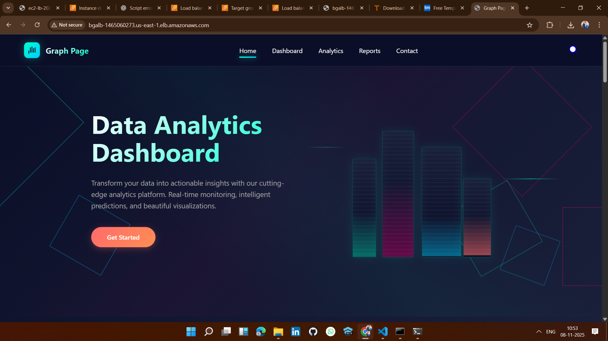

# 🚀 Project 8: EC2 Blue-Green Deployment using ALB (Zero-Downtime Deployment)

## 🪜 Step-by-Step Implementation

## ✅ STEP 1: Launch EC2 Instances (Blue Environment)
- Blue-Env-Instance-1  
- Blue-Env-Instance-2  

---

## ✅ STEP 2: Create Target Group for Blue Environment
- BlueTargetGroup
---
## ⬜ Create Target Group.
 

## ⬜ Register targets
 

## ⬜ Review and create
   

---

## ✅ STEP 3: Launch EC2 Instances (Green Environment)
Repeat the same process as in the Blue environment:
- Green-Env-Instance-1  
- Green-Env-Instance-2  

---

## ✅ STEP 4: Create Target Group for Green Environment
Repeat the same process as for the Blue Target Group.  
- BlueTargetGroup
- GreenTargetGroup
----

---

## ✅ STEP 5: Create an Application Load Balancer (ALB)
- BlueGreenALB
---

## ✅ STEP 6: Access the website with the help of ALB. 

---

## ✅ STEP 7: Switch Traffic (Blue → Green)

🎥 [Watch: How to Switch Traffic (Blue → Green)](Images/Vedio.mp4)

