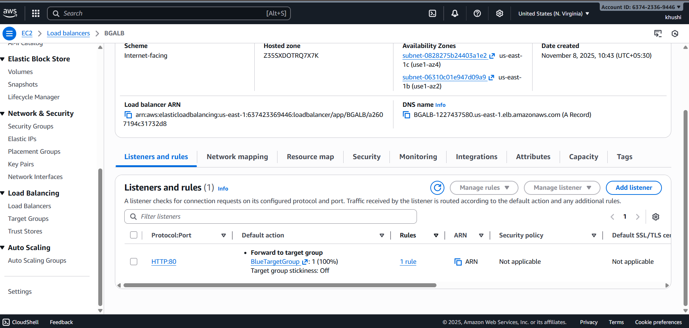

# 🚀 Project 8: EC2 Blue-Green Deployment using ALB (Zero-Downtime Deployment
)
## 🪜 Step-by-Step Implementation

## ✅ STEP 1: Launch EC2 Instances (Blue Environment)
i) Blue-Env-Instance-1
ii) Blue-Env-Instance-2 

## ✅ STEP 2: Create Target Group for Blue Environment

## ✅ STEP 3: Launch EC2 Instances (Green Environment)
do same for green instance 
i) Green-Env-Instance-1
ii) Green-Env-Instance-2 

## ✅ STEP 4: Create Target Group for Green Environment
do same for green instance 

## ✅ STEP 5: Create an Application Load Balancer (ALB)

## ✅ STEP 6: Test Both Environments
## ✅ STEP 7: Switch Traffic (Blue → Green)
[How can Switch Traffic](Images/Vedio.mp4)

