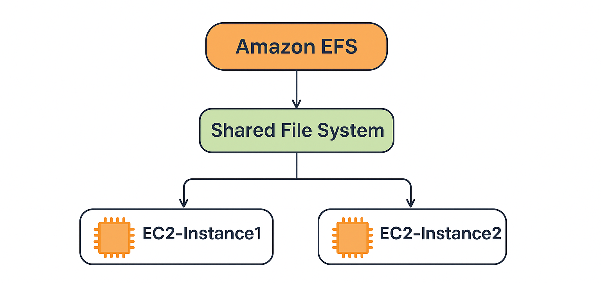

# 🚀 Project 9: AWS EFS Mount on EC2 Instances (Step-by-Step Implementation)
## 📘 Project Overview

This project demonstrates how to configure Amazon EFS (Elastic File System) and mount it on two EC2 instances to create a shared file system. Any file created on one EC2 instance is automatically visible on the other, enabling real-time file synchronization. This setup showcases how EFS can be used as a highly available, scalable, and shared network storage solution for multiple servers within the same VPC.

## ⚙️ Technologies Used
<pre>
1️⃣ Amazon EC2 – Virtual servers used to mount and access the shared file system
2️⃣ Amazon EFS (Elastic File System) – Fully managed shared storage service
3️⃣ VPC & Subnets – Network configuration for EFS and EC2 communication
4️⃣ Security Groups – Firewall rules allowing NFS (2049) traffic
5️⃣ Linux (Amazon Linux/Ubuntu) – Used for installing EFS utilities and mounting the file system
6️⃣ NFS Protocol – Protocol used by EFS for network-based file sharing
7️⃣ AWS Management Console – Used to create and configure AWS resources
8️⃣ SSH – For accessing EC2 instances and executing commands
 
</pre>

## 🏗️ Architecture Diagram
<Pre>
               +--------------------------+
               |       Amazon EFS        |
               |  Shared File System     |
               +-----------+--------------+
                           |
          -----------------------------------------
          |                                       |
+-------------------+                 +--------------------+
|     EC2-Instance1 |                 |    EC2-Instance2   |
|  /efs mount point |                 |  /efs mount point  |
+-------------------+                 +--------------------+

  → If you create a file on EC2-1, it automatically appears on EC2-2.
  → EFS acts as a shared storage that is accessible from both EC2 instances.

</pre>

## 🪜 Step-by-Step Implementation

## ✅ 1.Create an Amazon EFS file system
<pre>
▪ Go to AWS Console → Services → EFS → Create file system.
▪ Name it: FirstEFSfile
▪ Select the same VPC where your EC2 instances will run.
▪ Keep the default performance/throughput settings unless you need custom configurations.
▪ Note the File System ID (e.g., fs-0123456789abcdef0).

</pre>

## ✅ 2. Launch two EC2 instances (EC2-1 and EC2-2)
<pre>
 ▪ AWS Console → EC2 → Launch instances.
▪ Name the instances: FirstEC2Instance and SecEC2Instance.
▪ Choose Amazon Linux 2023 or Ubuntu LTS.
▪ Place both instances in the same VPC (they can be in different subnets/AZs).
▪ Attach a key pair for SSH access.
</pre>
## ✅ 3. Create / configure Security Groups
<pre>
▪ Create a security group for EFS (or reuse an existing one): allow inbound TCP 2049 (NFS) from the EC2 security group.
▪ EC2 security group should allow SSH (port 22) from your IP and allow inbound traffic from the other EC2 instance if needed.
▪ Ensure outbound rules allow traffic to reach the EFS mount targets.
</pre>

## ✅4. Install EFS utilities on each EC2
<pre>
⬜ First EC2 Instance
▪ Login to the first EC2 instance through SSH.
▪ Run: sudo -s
▪ Install EFS utilities: sudo yum install -y amazon-efs-utils
▪ Create a directory: mkdir EFSTest
▪ Mount EFS: mount -t nfs4 DNS_NAME:/ EFSTest/
▪ Navigate to the directory: cd EFSTest
▪ Create files: touch file{1..5}
▪ List files: ls
</pre>

<pre>
⬜ Second EC2 Instance
▪ Login to the second EC2 instance through SSH.
▪ Run: sudo -s
▪ Install NFS utilities: yum install -y nfs-utils
▪ Create a directory: mkdir khushi
▪ Mount EFS: mount -t nfs4 DNS_NAME:/ khushi/
▪ List files: ls
▪ Navigate to the directory: cd khushi
▪ List files again: ls
You will now see all the files that were created in the first EC2 instance.
</pre>

## ✅ 5.Now any changes made on one EC2 instance will automatically appear on the other EC2 instance.🎉

# 👩‍💻 Author
## Khushi Nigam
AWS EFS Distributed File System with EC2  Project | Cloud & DevOps Learner