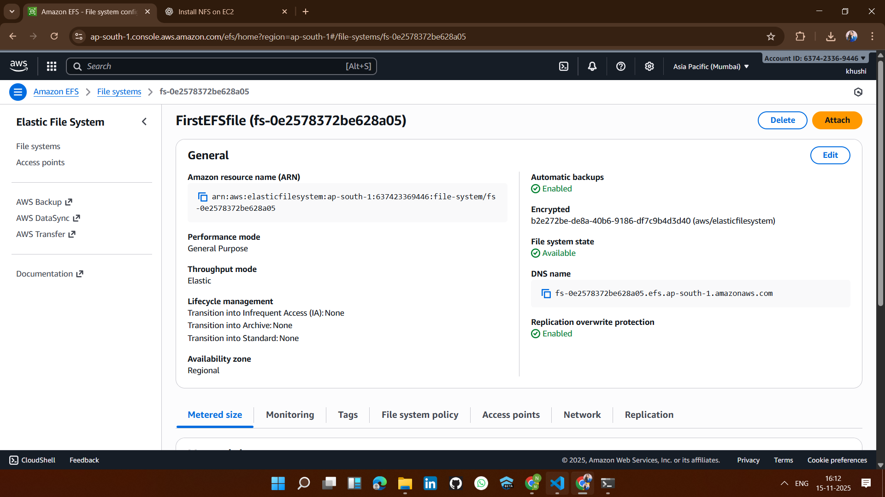
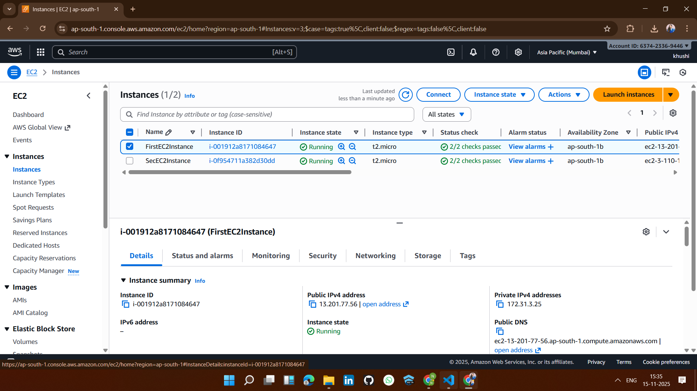
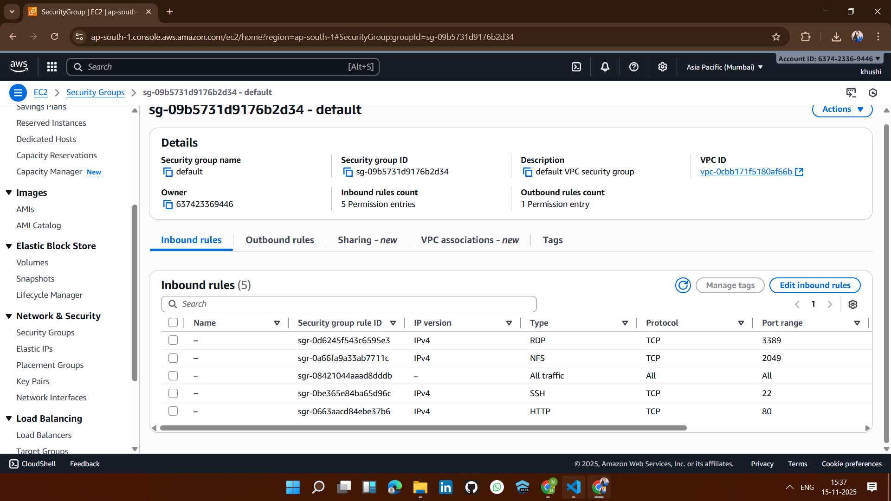
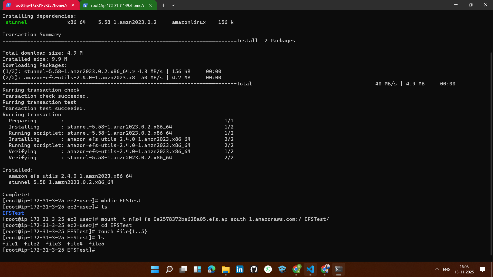
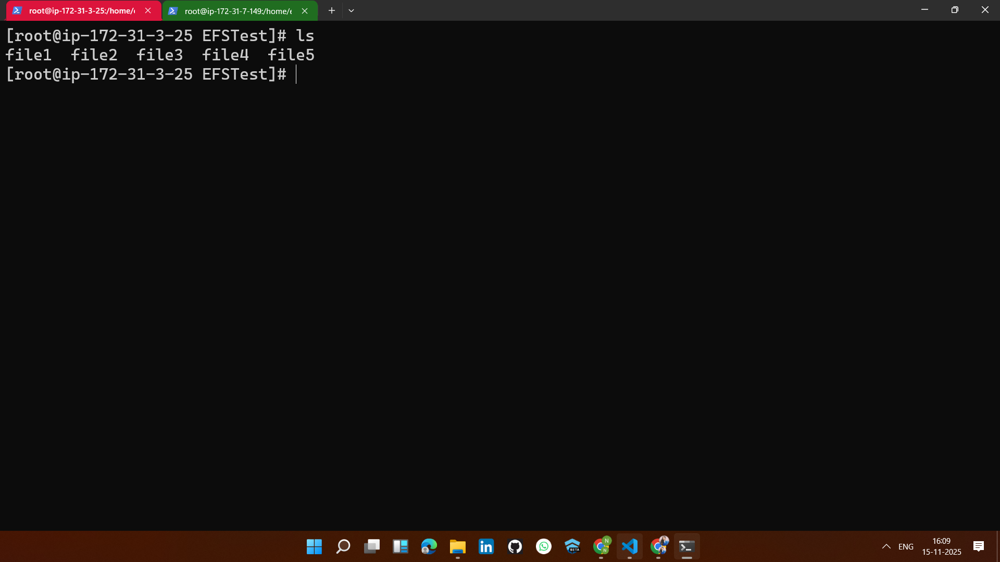
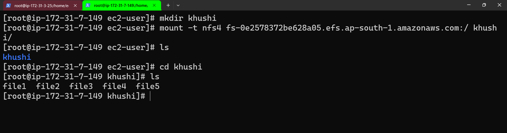

# 🚀 Project 9: AWS EFS Mount on EC2 Instances (Step-by-Step Implementation)

## 🪜 Step-by-Step Implementation (Solution)

## ✅ 1.Create an Amazon EFS file system

## ✅ 2. Launch two EC2 instances (EC2-1 and EC2-2)

## ✅ 3. Create / configure Security Groups

## ✅4. Install EFS utilities on each EC2

## ✅ 5.Now any changes made on one EC2 instance will automatically appear on the other EC2 instance.🎉
## EC2-1 

## EC2-2 

